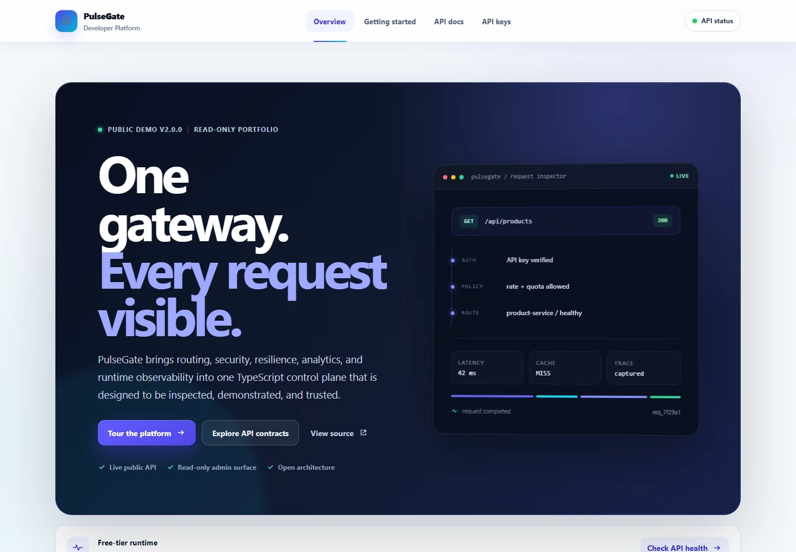
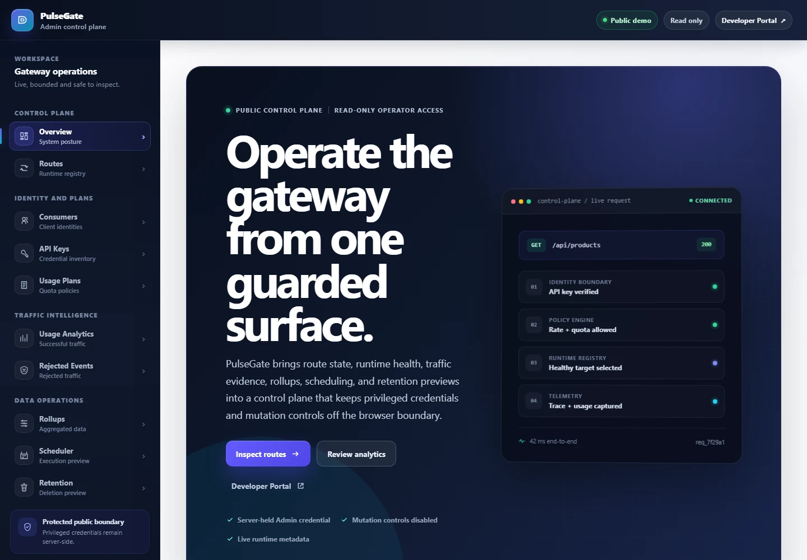
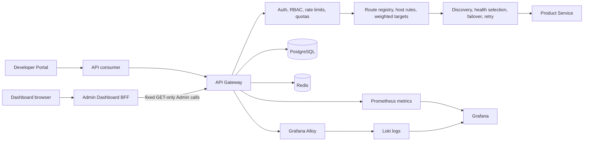

<div align="center">

# PulseGate

### Product-oriented API Gateway & API Management Platform

**Routing · Security · Resilience · Analytics · Operations · Observability**

<p>
  <a href="docs/releases/v2.0.0.md"></a>
  
  
  
</p>

<p>
  <a href="https://pulsegate-developer-portal.netlify.app"></a>
  <a href="https://pulsegate-admin-dashboard.netlify.app"></a>
  <a href="https://pulsegate-public-demo-api.onrender.com/health"></a>
  <a href="docs/architecture/overview.md"></a>
</p>

A portfolio-grade platform that follows an API request from admission and policy enforcement<br>
through runtime routing, downstream delivery, analytics, traces, metrics, and logs.

</div>

<p align="center">
  
</p>

> [!IMPORTANT]
> The full post-release visual redesign is complete in source on `main`. The public UI uses free-tier Netlify hosting and may temporarily remain on an older deploy or go offline when monthly team credits are exhausted. The Render API may also cold-start after inactivity.

---

## Why PulseGate

Many API gateway demos stop at reverse proxying. PulseGate demonstrates the broader system around that proxy:

```text
consumer request
  -> authentication and request boundaries
  -> rate, quota, cache, and policy evaluation
  -> route registry and target selection
  -> service discovery, health selection, failover, and retry
  -> downstream response
  -> usage, rejection, metric, trace, and log evidence
```

<table>
  <tr>
    <td width="25%"><strong>Traffic control</strong><br><sub>Dynamic routes, host rules, weighted upstreams, discovery, health selection, retries, timeouts, and transforms.</sub></td>
    <td width="25%"><strong>Security boundary</strong><br><sub>API keys, JWT, rate limits, quotas, request limits, Admin RBAC, and server-only credentials.</sub></td>
    <td width="25%"><strong>Operational evidence</strong><br><sub>Usage analytics, rejected events, rollups, scheduler previews, retention previews, and guarded execution contracts.</sub></td>
    <td width="25%"><strong>Observability</strong><br><sub>OpenTelemetry, Prometheus, Grafana Alloy, Loki, Grafana, structured logs, and bounded k6 smoke validation.</sub></td>
  </tr>
</table>

---

## Product experience

### Developer Portal

A static-first, unprivileged product surface for onboarding, curated API contracts, public error guidance, and explanation of the API-key boundary.

- No developer account or session.
- No browser secret storage.
- No privileged Admin API access.
- Direct navigation to the public Dashboard and API health surfaces.

### Admin control plane

<p align="center">
  
</p>

The Next.js Dashboard is a **read-only operator control plane**:

- Fixed GET-only BFF resources instead of a generic Admin proxy.
- A server-held read-only credential that is never delivered to the browser.
- Route, consumer, API-key, usage-plan, analytics, rollup, scheduler, and retention inspection.
- No browser mutation controls and no exposure of issued API-key secrets.

---

## Technology stack

<div align="center">

### Runtime & Web


### Data & Policy


### Observability


### Delivery & Validation


</div>

---

## Implemented capabilities

| Area | Capabilities |
| --- | --- |
| **Gateway runtime** | Dynamic route registry, path and host matching, weighted upstreams, service discovery, health-aware failover, bounded retries, request IDs, transforms, timeouts, and downstream proxying |
| **Security** | Database-backed and environment-fallback API keys, JWT authentication, security headers, request-size limits, rate limiting, quota enforcement, Admin RBAC, and server-only credential boundaries |
| **API management** | Consumers, API keys, usage plans, route configuration, runtime route inspection, quota state, and fixed read-only Dashboard BFF resources |
| **Analytics** | Successful usage events, rejected/security events, bounded filters, summaries, cursor pagination, quota views, and raw event inspection |
| **Operations** | Persisted rollup reads, scheduler previews, retention previews, explicit execution modes, bounded limits, and fail-closed destructive-operation guards |
| **Observability** | Structured logs, trace/span correlation, OpenTelemetry propagation, Grafana Alloy, Loki, Prometheus metrics, Grafana dashboards, and bounded k6 smoke validation |
| **Delivery** | npm workspaces, strict TypeScript, Vitest, multi-stage containers, Docker Compose, GitHub Actions, Kubernetes Kustomize overlays, runbooks, decision records, and release evidence |

---

## Architecture



### Sources of truth

- PostgreSQL stores route configuration, consumers, API keys, usage plans, successful usage events, rejected events, and analytics rollups.
- Redis backs rate limiting and response caching.
- Raw successful usage events remain the source of truth for usage analytics and quota counting.
- Rejected/security events remain separate from successful usage.
- Rollups are read models and never replace quota-counting sources.

---

## Security and operational boundaries

| Boundary | Guarantee |
| --- | --- |
| **Public Dashboard** | Read-only BFF resources; no generic Admin proxy |
| **Admin credentials** | Server-side only; never browser-visible |
| **API-key material** | Issued secrets are not returned by public read surfaces |
| **Scheduler & retention** | Preview-first, bounded, explicit, fail-closed |
| **Quota source** | Raw successful usage events remain canonical |
| **Rejected traffic** | Recorded separately from successful usage |
| **Observability labels** | Bounded route templates; correlation IDs remain in structured bodies |
| **k6 evidence** | Lightweight smoke only; not capacity, soak, SLA, or SLO certification |

---

## Release and validation

### Official Product/Platform v2 release

The immutable `v2.0.0` tag points to:

```text
7a3d36574d2400086395d2206c1fa881b874a099
```

| Workspace | Test files | Tests |
| --- | ---: | ---: |
| Admin Dashboard | 55 | 253 |
| API Gateway | 163 | 1,177 |
| Developer Portal | 2 | 8 |
| Product Service | 10 | 36 |
| **Total** | **230** | **1,474** |

Additional release evidence:

- All workspace typechecks and production builds passed.
- Release-readiness and documentation-integrity checks passed.
- Docker Compose validated with 10 services.
- All Kubernetes Kustomize targets rendered successfully.
- The bounded end-to-end demo and bounded k6 smoke passed.
- Runtime cleanup completed without named-volume deletion.

### Post-release visual product hardening

| Workspace | Test files | Tests | Typecheck | Production build |
| --- | ---: | ---: | --- | --- |
| Admin Dashboard | 55 | 255 | Pass | Pass |
| Developer Portal | 2 | 9 | Pass | Pass |

The visual redesign changes presentation, navigation, responsive behavior, and information hierarchy without expanding the public security boundary or adding backend behavior.

---

## Public demo availability

| Surface | URL | Notes |
| --- | --- | --- |
| Developer Portal | [Open Portal](https://pulsegate-developer-portal.netlify.app) | May pause when Netlify free credits are exhausted |
| Admin Dashboard | [Open Dashboard](https://pulsegate-admin-dashboard.netlify.app) | Read-only; may temporarily serve an older deploy until credits reset |
| Gateway health | [Check health](https://pulsegate-public-demo-api.onrender.com/health) | Render free-tier cold starts are possible |
| Product Service through Gateway | [Check downstream health](https://pulsegate-public-demo-api.onrender.com/api/product-service/health) | Demonstrates routing through PulseGate |

After Netlify credits reset, redeploy the latest `main` commit once for each UI project and run the final public visual QA again.

---

## Run locally

### Prerequisites

- Node.js 20 or newer
- npm
- Docker Desktop with Docker Compose
- PowerShell for the documented Windows validation workflow

### Install and validate

```powershell
npm.cmd ci
npm.cmd run test
npm.cmd run typecheck
npm.cmd run build
```

### Start the platform

Configure separate full-access and read-only Admin keys according to the [Admin Dashboard runbook](docs/runbooks/admin-dashboard.md), then run:

```powershell
docker compose up -d --build
docker compose ps
```

| Service | Local URL |
| --- | --- |
| API Gateway | `http://127.0.0.1:3000` |
| Product Service | `http://127.0.0.1:3001` |
| Grafana | `http://127.0.0.1:3002` |
| Admin Dashboard | `http://127.0.0.1:3003` |
| Developer Portal | `http://127.0.0.1:3004` |
| Prometheus | `http://127.0.0.1:9090` |

Keep credentials out of source code and browser-visible environment variables.

### Run the bounded demo and smoke test

```powershell
powershell.exe `
  -NoProfile `
  -ExecutionPolicy Bypass `
  -File scripts/demo-runtime.ps1 `
  -ArtifactDirectory E:\pulsegate-artifacts\demo

npm.cmd run test:k6:smoke
```

---

## Repository map

<details>
<summary><strong>Open repository guide</strong></summary>

| Path | Purpose |
| --- | --- |
| `apps/api-gateway` | Gateway runtime, Admin APIs, routing, traffic policies, analytics, and database integration |
| `apps/product-service` | Downstream service used by the gateway demo |
| `apps/admin-dashboard` | Read-only operational control plane |
| `apps/developer-portal` | Public developer-facing product surface |
| `deploy/kubernetes` | Base manifests and local Kustomize overlays |
| `deploy/public-demo` | Public demo runtime packaging |
| `observability` | Prometheus, Grafana, Loki, Alloy, and k6 assets |
| `docs/architecture` | Architecture and runtime boundaries |
| `docs/runbooks` | Local validation and operational procedures |
| `docs/project-context/decisions` | Architecture and product decision records |
| `docs/sdlc/sprint-history` | Historical delivery evidence |

</details>

## Documentation

- [Architecture overview](docs/architecture/overview.md)
- [Current canonical state](docs/project-context/CURRENT_PROGRESS.md)
- [Product/Platform v2 release notes](docs/releases/v2.0.0.md)
- [Final requirements](docs/sdlc/requirements.md)
- [Local validation runbook](docs/runbooks/local-validation.md)
- [Admin Dashboard runbook](docs/runbooks/admin-dashboard.md)
- [Developer Portal runbook](docs/runbooks/developer-portal.md)
- [End-to-end demo and k6 runbook](docs/runbooks/end-to-end-demo-and-k6.md)
- [Observability validation runbook](docs/runbooks/observability-validation.md)

---

## Scope boundaries

PulseGate is an engineering portfolio platform and public demonstration. It does not claim:

- Production capacity, high availability, SLA, or SLO certification.
- Enterprise compliance certification.
- Complete production multi-tenancy or billing.
- A public developer identity and ownership system.
- Browser-based issuance of real API keys.
- A canonical generated OpenAPI reference.
- Production secret management for the local Kubernetes overlay.
- Destructive retention controls in the public Dashboard.

The fixed Sprint 45-80 roadmap is complete. **No Sprint 81 is defined.**

## License

No license file is currently included. All rights are reserved unless a license is added explicitly.
