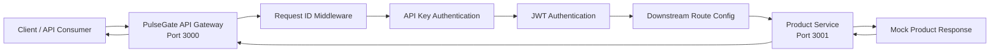

# PulseGate

<p align="center">
  <strong>High-Traffic API Gateway & Observability Platform</strong>
</p>

<p align="center">
  A local-first API Gateway, API Management, and Observability learning project built with Node.js, TypeScript, Fastify, and a microservice-oriented architecture.
</p>

<p align="center">
  
  
  
  
  
  
  
  
  
  
</p>

---

## Overview

**PulseGate** is a mini API Gateway + API Management + Observability Platform inspired by:

* Kong
* Apache APISIX
* Tyk
* Apigee
* AWS API Gateway

The project is designed to demonstrate backend engineering skills around API routing, microservice communication, authentication, request tracing, error handling, testing, observability, scalability, and production-oriented system design.

PulseGate starts small and grows step by step.

Current stable flow:

```txt
Client
  -> API Gateway :3000
    -> Request ID handling
    -> API key authentication
    -> JWT authentication
    -> Downstream route configuration
    -> Downstream timeout handling
    -> Normalized downstream error handling
    -> Product Service :3001
      -> Mock Product Response
```

Current version:

```txt
v0.2.0
```

Current sprint status:

```txt
Sprint 1 - Complete
```

---

## Project Status

| Area            | Status                                                                                     | Notes                                    |
| --------------- | ------------------------------------------------------------------------------------------ | ---------------------------------------- |
| Sprint 0        |                       | Core setup and basic Gateway flow        |
| Sprint 1        |                       | API Gateway core features                |
| Current Version |                                 | Stable local-first Gateway foundation    |
| Automated Tests |                  | Unit and integration tests               |
| Typecheck       |                      | TypeScript validation passes             |
| Build           |                          | Production build passes                  |
| Next Sprint     |  | Traffic protection before infrastructure |

---

## Why PulseGate?

Modern backend systems often contain many services. Without an API Gateway, clients may need to call each service directly, which creates problems around routing, security, rate limiting, logging, monitoring, and scaling.

PulseGate aims to solve these problems by acting as a single entry point for APIs.

Long-term goals:

* Route requests to the correct backend service.
* Validate API keys and JWT tokens.
* Apply rate limiting to protect services.
* Add Redis caching to reduce backend load.
* Log requests with request IDs.
* Expose metrics for monitoring.
* Add distributed tracing.
* Stream events with Kafka.
* Process background jobs with RabbitMQ.
* Run load tests with k6.
* Support Docker Compose and later Kubernetes.
* Provide an Admin Dashboard and Developer Portal later.

---

## Current Features

### Sprint 0 - Core Setup & Basic Gateway Flow

| Feature                                                      | Status                                                        |
| ------------------------------------------------------------ | ------------------------------------------------------------- |
| API Gateway running on port `3000`                           |  |
| Product Service running on port `3001`                       |  |
| Gateway route: `GET /api/products`                           |  |
| Product Service route: `GET /products`                       |  |
| Health check APIs                                            |  |
| Request ID generation                                        |  |
| Request ID propagation from Gateway to Product Service       |  |
| JSON logging                                                 |  |
| Basic 404 error handling                                     |  |
| Basic 500 error handling                                     |  |
| TypeScript strict mode                                       |  |
| npm workspaces monorepo                                      |  |
| Clean service structure with config, routes, and middlewares |  |
| Project context documentation                                |  |
| Architecture documentation                                   |  |
| Requirements documentation                                   |  |

### Sprint 1 - API Gateway Core Features

| Feature                                                                                     | Status                                                        |
| ------------------------------------------------------------------------------------------- | ------------------------------------------------------------- |
| Normalized downstream service errors                                                        |  |
| Downstream request timeout using `AbortController`                                          |  |
| Configurable downstream timeout through `DOWNSTREAM_REQUEST_TIMEOUT_MS`                     |  |
| Downstream route configuration foundation                                                   |  |
| API key authentication                                                                      |  |
| Configurable API key header through `API_KEY_HEADER`                                        |  |
| Local API key list through `API_KEYS`                                                       |  |
| JWT authentication using `jose`                                                             |  |
| JWT config through `JWT_SECRET`, `JWT_ISSUER`, `JWT_AUDIENCE`, and `JWT_EXPIRES_IN_SECONDS` |  |
| Protected route with API key and JWT                                                        |  |
| Unit test setup with Vitest                                                                 |  |
| Integration tests using Fastify `app.inject()`                                              |  |
| Manual validation for API key and JWT protected routes                                      |  |

---

## Current Architecture



Current protected request flow:

```txt
GET http://localhost:3000/api/products

Client
  -> API Gateway
    -> Create or reuse x-request-id
    -> Check x-api-key
      -> Missing: 401 API_KEY_MISSING
      -> Invalid: 403 API_KEY_INVALID
    -> Check Authorization Bearer token
      -> Missing: 401 JWT_TOKEN_MISSING
      -> Invalid: 403 JWT_TOKEN_INVALID
    -> Call Product Service
      -> GET http://127.0.0.1:3001/products
    -> Product Service returns products
    -> API Gateway returns response to Client
```

Current public request flow:

```txt
GET http://localhost:3000/health

Client
  -> API Gateway
  -> Health response
```

---

## Monorepo Structure

```txt
pulsegate/
  apps/
    api-gateway/
      src/
        app.ts
        app.test.ts
        config/
          downstream-routes.ts
          env.ts
          env.test.ts
        errors/
          downstream-service-error.ts
          downstream-service-error.test.ts
        middlewares/
          api-key-auth.middleware.ts
          api-key-auth.middleware.test.ts
          error-handler.middleware.ts
          jwt-auth.middleware.ts
          jwt-auth.middleware.test.ts
          request-id.middleware.ts
          request-id.middleware.test.ts
        routes/
          health.route.ts
          product-proxy.route.ts
        server.ts
      package.json
      tsconfig.json
      vitest.config.ts

    product-service/
      src/
        config/
          env.ts
        middlewares/
          error-handler.middleware.ts
          request-id.middleware.ts
        routes/
          health.route.ts
          product.route.ts
        server.ts
      package.json
      tsconfig.json

  packages/
    shared/
      src/
        errors/
        types/

  docs/
    architecture/
      overview.md
    sdlc/
      requirements.md
    project-context/
      AI_HANDOFF.md
      CURRENT_PROGRESS.md
      DECISION_LOG.md

  infra/

  .env.example
  .gitattributes
  .gitignore
  package.json
  package-lock.json
  README.md
```

---

## Services

### API Gateway

Location:

```txt
apps/api-gateway
```

Port:

```txt
3000
```

Endpoints:

```txt
GET /health
GET /api/products
```

Route protection:

```txt
GET /health
  -> Public

GET /api/products
  -> Requires API key
  -> Requires JWT Bearer token
```

Responsibilities:

* Acts as the single entry point.
* Receives client requests.
* Creates or reuses request IDs.
* Adds `x-request-id` response header.
* Routes product API requests to Product Service.
* Forwards `x-request-id` to downstream services.
* Applies API key authentication.
* Applies JWT authentication.
* Attaches verified JWT payload to `request.jwtPayload`.
* Applies downstream request timeout.
* Normalizes downstream service errors.
* Handles basic 404 and 500 errors.
* Logs requests in JSON format.
* Supports automated integration tests using `app.inject()`.

---

### Product Service

Location:

```txt
apps/product-service
```

Port:

```txt
3001
```

Endpoints:

```txt
GET /health
GET /products
```

Responsibilities:

* Provides product-related APIs.
* Returns mock product data.
* Creates or reuses request IDs.
* Reuses request ID from API Gateway.
* Handles basic 404 and 500 errors.
* Logs requests in JSON format.

---

## Tech Stack

Currently implemented:

| Category       | Technology                 | Status                                                            |
| -------------- | -------------------------- | ----------------------------------------------------------------- |
| Runtime        | Node.js                    |  |
| Language       | TypeScript                 |  |
| Web Framework  | Fastify                    |  |
| Monorepo       | npm workspaces             |  |
| Logging        | Fastify JSON logger        |  |
| Authentication | API Key, JWT               |  |
| JWT Library    | jose                       |  |
| Testing        | Vitest                     |  |
| Architecture   | API Gateway + Microservice |  |

Planned later:

| Category         | Technology                   | Status                                                            |
| ---------------- | ---------------------------- | ----------------------------------------------------------------- |
| Database         | PostgreSQL                   |  |
| ORM              | Prisma                       |  |
| Cache            | Redis                        |  |
| Event Streaming  | Kafka                        |  |
| Background Jobs  | RabbitMQ                     |  |
| Metrics          | Prometheus                   |  |
| Dashboard        | Grafana                      |  |
| Tracing          | OpenTelemetry + Jaeger/Tempo |  |
| Logs             | Loki                         |  |
| Load Testing     | k6                           |  |
| Containerization | Docker, Docker Compose       |  |
| Orchestration    | Kubernetes                   |  |
| CI/CD            | GitHub Actions               |  |

---

## Getting Started

### 1. Clone the repository

```powershell
git clone https://github.com/VuNguyen26/pulsegate.git
cd pulsegate
```

### 2. Install dependencies

```powershell
npm install
```

### 3. Run Product Service

Open terminal 1:

```powershell
npm run dev:product
```

Product Service runs on:

```txt
http://localhost:3001
```

### 4. Run API Gateway

Open terminal 2:

```powershell
npm run dev:gateway
```

API Gateway runs on:

```txt
http://localhost:3000
```

---

## Test APIs Manually

### Product Service Health Check

```powershell
Invoke-RestMethod http://localhost:3001/health | ConvertTo-Json -Depth 10
```

Expected response:

```json
{
  "service": "product-service",
  "status": "ok",
  "timestamp": "2026-06-25T00:00:00.000Z"
}
```

### Product Service Products API

```powershell
Invoke-RestMethod http://localhost:3001/products | ConvertTo-Json -Depth 10
```

Expected response:

```json
{
  "data": [
    {
      "id": "prod_001",
      "name": "Mechanical Keyboard",
      "price": 120
    },
    {
      "id": "prod_002",
      "name": "Gaming Mouse",
      "price": 45
    }
  ]
}
```

### API Gateway Health Check

```powershell
Invoke-RestMethod http://localhost:3000/health | ConvertTo-Json -Depth 10
```

Expected response:

```json
{
  "service": "api-gateway",
  "status": "ok",
  "timestamp": "2026-06-25T00:00:00.000Z"
}
```

### Create Local Development JWT Token

```powershell
$token = node --input-type=module -e "import { SignJWT } from 'jose'; const secretKey = new TextEncoder().encode('local-dev-jwt-secret-change-me'); const expiresAt = Math.floor(Date.now() / 1000) + 900; const token = await new SignJWT({ role: 'user' }).setProtectedHeader({ alg: 'HS256' }).setSubject('user_123').setIssuer('pulsegate-api-gateway').setAudience('pulsegate-clients').setExpirationTime(expiresAt).sign(secretKey); console.log(token);"
```

Check token:

```powershell
$token
```

### API Gateway Product Proxy API

This route requires both API key and JWT.

```powershell
Invoke-RestMethod http://localhost:3000/api/products `
  -Headers @{
    "x-api-key" = "dev-api-key"
    "authorization" = "Bearer $token"
  } |
  ConvertTo-Json -Depth 10
```

Expected response:

```json
{
  "data": [
    {
      "id": "prod_001",
      "name": "Mechanical Keyboard",
      "price": 120
    },
    {
      "id": "prod_002",
      "name": "Gaming Mouse",
      "price": 45
    }
  ]
}
```

---

## Authentication Behavior

### API Key Authentication

Protected route:

```txt
GET /api/products
```

Default header:

```txt
x-api-key
```

Default local API key:

```txt
dev-api-key
```

Behavior:

```txt
Missing API key
  -> 401 API_KEY_MISSING

Invalid API key
  -> 403 API_KEY_INVALID

Valid API key
  -> Continue to JWT authentication
```

### JWT Authentication

Protected route:

```txt
GET /api/products
```

Default header:

```txt
Authorization: Bearer <jwt-token>
```

Default local JWT config:

```txt
JWT_SECRET=local-dev-jwt-secret-change-me
JWT_ISSUER=pulsegate-api-gateway
JWT_AUDIENCE=pulsegate-clients
JWT_EXPIRES_IN_SECONDS=900
```

Behavior:

```txt
Missing Bearer token
  -> 401 JWT_TOKEN_MISSING

Invalid Bearer token
  -> 403 JWT_TOKEN_INVALID

Valid Bearer token
  -> Continue to Product Service
```

JWT validation checks:

```txt
Signature
Issuer
Audience
Expiration
```

---

## Downstream Error Behavior

PulseGate normalizes downstream Product Service failures.

```txt
Product Service unavailable
  -> 503 DOWNSTREAM_SERVICE_UNAVAILABLE

Product Service timeout
  -> 504 DOWNSTREAM_TIMEOUT

Product Service returns error status
  -> 502 DOWNSTREAM_HTTP_ERROR

Product Service returns invalid JSON
  -> 502 DOWNSTREAM_INVALID_RESPONSE
```

Example unavailable response:

```json
{
  "error": {
    "code": "DOWNSTREAM_SERVICE_UNAVAILABLE",
    "message": "Product Service is currently unavailable",
    "service": "product-service",
    "requestId": "example-request-id"
  }
}
```

---

## Request ID Propagation

PulseGate supports request ID propagation from the beginning.

Current behavior:

```txt
Client
  -> API Gateway creates or reuses x-request-id
  -> API Gateway returns x-request-id in response header
  -> API Gateway forwards x-request-id to Product Service
  -> Product Service reuses the same request ID
```

Why this matters:

* Easier debugging.
* Better request tracking.
* Foundation for distributed tracing.
* Helps connect logs across services.

---

## Automated Tests

PulseGate uses Vitest for unit and integration tests.

Run tests:

```powershell
npm run test
```

Current result:

```txt
6 test files passed
46 tests passed
```

Current unit test coverage:

```txt
request-id.middleware.test.ts
  -> Request ID generation and reuse

api-key-auth.middleware.test.ts
  -> Missing, invalid, valid, and array header API key cases

jwt-auth.middleware.test.ts
  -> Bearer token extraction, JWT verification, missing token, invalid token, valid token

downstream-service-error.test.ts
  -> DownstreamServiceError and type guard behavior

env.test.ts
  -> Number, CSV, and string env parsing
```

Current integration test coverage:

```txt
GET /health
  -> 200 OK

GET /api/products without API key
  -> 401 API_KEY_MISSING

GET /api/products with invalid API key
  -> 403 API_KEY_INVALID

GET /api/products with valid API key but missing JWT
  -> 401 JWT_TOKEN_MISSING

GET /api/products with valid API key but invalid JWT
  -> 403 JWT_TOKEN_INVALID

GET /api/products with valid API key and valid JWT
  -> 200 and product data

GET /api/products with valid API key and valid JWT but downstream unavailable
  -> 503 DOWNSTREAM_SERVICE_UNAVAILABLE

GET /api/products with valid API key and valid JWT but downstream returns 500
  -> 502 DOWNSTREAM_HTTP_ERROR

GET /api/products with valid API key and valid JWT but downstream returns invalid JSON
  -> 502 DOWNSTREAM_INVALID_RESPONSE

GET /api/products with valid API key and valid JWT but downstream times out
  -> 504 DOWNSTREAM_TIMEOUT
```

---

## Development Commands

Run API Gateway:

```powershell
npm run dev:gateway
```

Run Product Service:

```powershell
npm run dev:product
```

Run tests:

```powershell
npm run test
```

Typecheck all workspaces:

```powershell
npm run typecheck
```

Build all workspaces:

```powershell
npm run build
```

---

## Documentation

Project documentation is stored in the `docs` folder.

| Document                                   | Description                                |
| ------------------------------------------ | ------------------------------------------ |
| `docs/architecture/overview.md`            | Current and future architecture overview   |
| `docs/sdlc/requirements.md`                | Functional and non-functional requirements |
| `docs/project-context/CURRENT_PROGRESS.md` | Current project progress                   |
| `docs/project-context/DECISION_LOG.md`     | Technical decision records                 |
| `docs/project-context/AI_HANDOFF.md`       | Context file for continuing with AI help   |

---

## Roadmap

### Sprint 0 - Core Setup & Basic Gateway Flow

Status: 

| Feature                                   | Status                                                        |
| ----------------------------------------- | ------------------------------------------------------------- |
| Create GitHub repository                  |  |
| Set up npm workspaces                     |  |
| Set up TypeScript                         |  |
| Create API Gateway                        |  |
| Create Product Service                    |  |
| Add basic Gateway to Product Service flow |  |
| Add health check APIs                     |  |
| Add request ID handling                   |  |
| Add JSON logger                           |  |
| Add basic error handlers                  |  |
| Refactor API Gateway structure            |  |
| Refactor Product Service structure        |  |
| Add project context docs                  |  |
| Add architecture overview                 |  |
| Add requirements document                 |  |
| Improve README                            |  |
| Add `.env.example`                        |  |

### Sprint 1 - API Gateway Core Features

Status: 

| Feature                                       | Status                                                        |
| --------------------------------------------- | ------------------------------------------------------------- |
| Normalize downstream service errors           |  |
| Add downstream request timeout                |  |
| Add downstream route configuration foundation |  |
| Add API key authentication                    |  |
| Add JWT authentication                        |  |
| Add basic unit test setup                     |  |
| Add request ID unit tests                     |  |
| Add API key authentication unit tests         |  |
| Add JWT authentication unit tests             |  |
| Add downstream error unit tests               |  |
| Add environment parsing unit tests            |  |
| Add API Gateway integration tests             |  |
| Add manual validation for protected routes    |  |

### Sprint 2 - Gateway Traffic Protection

Status: 

| Feature                                       | Status                                                         | Notes                                   |
| --------------------------------------------- | -------------------------------------------------------------- | --------------------------------------- |
| Add in-memory rate limiting foundation        |  | Start with behavior before Redis        |
| Add route-level rate limit configuration      |  | Per-route traffic rules                 |
| Add rate limit response behavior              |  | Return `429 TOO_MANY_REQUESTS`          |
| Add request size limit                        |  | Protect Gateway from oversized payloads |
| Add basic security headers                    |  | Improve HTTP response safety            |
| Add route-level auth configuration refinement |  | Move auth rules closer to route config  |
| Add traffic protection tests                  |  | Unit and integration tests              |

### Sprint 3 - Data & Infrastructure Foundation

Status: 

| Feature                                      | Status                                                            |
| -------------------------------------------- | ----------------------------------------------------------------- |
| Add PostgreSQL                               |  |
| Add Prisma                                   |  |
| Replace mock product data with database data |  |
| Add Docker Compose                           |  |
| Containerize API Gateway                     |  |
| Containerize Product Service                 |  |
| Add Redis-backed rate limiting               |  |
| Add response caching                         |  |

### Sprint 4 - Observability

Status: 

| Feature                           | Status                                                            |
| --------------------------------- | ----------------------------------------------------------------- |
| Add Prometheus metrics            |  |
| Add Grafana dashboard             |  |
| Add OpenTelemetry                 |  |
| Add Jaeger or Tempo               |  |
| Add structured log pipeline later |  |

### Sprint 5 - Event-Driven Architecture

Status: 

| Feature                       | Status                                                            |
| ----------------------------- | ----------------------------------------------------------------- |
| Add Kafka event streaming     |  |
| Add RabbitMQ background jobs  |  |
| Add Notification Service      |  |
| Add async processing examples |  |

### Future

| Feature                | Status                                                          |
| ---------------------- | --------------------------------------------------------------- |
| Admin Dashboard        |  |
| Developer Portal       |  |
| k6 load testing        |  |
| GitHub Actions CI/CD   |  |
| Kubernetes deployment  |  |
| Cloud lightweight demo |  |

---

## Current Status

PulseGate currently has a stable local API Gateway foundation.

Stable flow:

```txt
Client
  -> API Gateway :3000
    -> Request ID handling
    -> API key authentication
    -> JWT authentication
    -> Downstream route configuration
    -> Downstream timeout handling
    -> Normalized downstream error handling
    -> Product Service :3001
      -> Mock Product Response
```

Latest stable Sprint 1 commits:

```txt
f66d523 feat(gateway): normalize downstream service errors
32af4ab feat(gateway): add downstream request timeout
27f40bb refactor(gateway): add downstream route configuration
940806f feat(gateway): add api key authentication
6c93cbe test(gateway): add basic unit test setup
2b742d3 test(gateway): add api key auth unit tests
7388dab test(gateway): add downstream error unit tests
5023e36 test(gateway): add env parsing unit tests
7f100de test(gateway): prepare app for integration tests
056ed7a test(gateway): add api key route integration tests
8fe5aae test(gateway): add valid api key product route integration test
2fca28e test(gateway): add downstream failure integration tests
10d512a test(gateway): add downstream timeout integration test
82672c6 feat(gateway): add jwt configuration
ad0a9fd feat(gateway): add jwt authentication middleware
9cc8e88 test(gateway): add jwt auth unit tests
c233071 feat(gateway): protect product route with jwt
```

---

## Project Principles

PulseGate follows these principles:

* Local-first.
* Cloud-optional.
* Cost-safe.
* Small steps before complex infrastructure.
* Clean architecture before scaling.
* Observability from the beginning.
* Production-oriented learning.
* Automated tests before major refactors.
* Behavior first, infrastructure later.
* GitHub-ready documentation.

---

## License

This project is licensed under the MIT License.
