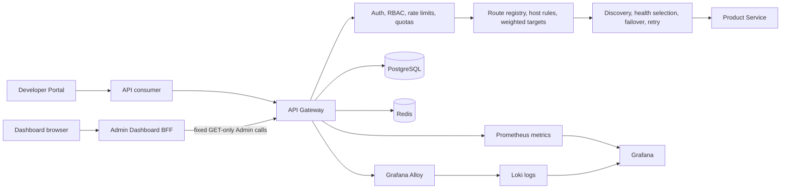

# PulseGate

**A product-oriented API Gateway and API management platform built with TypeScript, Fastify, PostgreSQL, Redis, Next.js, OpenTelemetry, Loki, Prometheus, Grafana, Docker Compose, and Kubernetes.**

[Developer Portal](https://pulsegate-developer-portal.netlify.app) |
[Admin Dashboard](https://pulsegate-admin-dashboard.netlify.app) |
[API health](https://pulsegate-public-demo-api.onrender.com/health) |
[Product Service through Gateway](https://pulsegate-public-demo-api.onrender.com/api/product-service/health) |
[v2.0.0 release notes](docs/releases/v2.0.0.md)

> **Project status:** Product/Platform v2.0.0 is released, the fixed Sprint 45-80 roadmap is complete, and the post-release visual product redesign is complete in source on `main`. The public UI sites use free-tier hosting and may be temporarily unavailable or lag the latest source when hosting credits are exhausted.

PulseGate demonstrates how an API gateway can combine traffic routing, authentication, rate and quota enforcement, resilience, analytics, operations, and observability behind explicit security boundaries. It is presented as a portfolio-grade engineering system, not as a production SaaS or capacity-certified service.

## Why PulseGate

Most gateway demos stop at reverse proxying. PulseGate follows a request across the full operational path:

```text
consumer request
  -> authentication and request boundaries
  -> rate, quota, cache, and policy evaluation
  -> route registry and target selection
  -> service discovery, health selection, failover, and retry
  -> downstream response
  -> usage, rejection, metric, trace, and log evidence
```

The repository includes the runtime, data model, read-only operator experience, developer-facing documentation, observability stack, deployment assets, validation scripts, and architecture records needed to explain that path end to end.

## Explore the system

| Surface | Purpose |
| --- | --- |
| [Developer Portal](https://pulsegate-developer-portal.netlify.app) | Public onboarding, API contracts, error guidance, and API-key boundary documentation |
| [Admin Dashboard](https://pulsegate-admin-dashboard.netlify.app) | Read-only inspection of routes, consumers, credentials, plans, analytics, rollups, scheduler previews, and retention previews |
| [Gateway health](https://pulsegate-public-demo-api.onrender.com/health) | Public API Gateway health check |
| [Product Service through Gateway](https://pulsegate-public-demo-api.onrender.com/api/product-service/health) | Downstream health request routed through PulseGate |
| [v2.0.0 release notes](docs/releases/v2.0.0.md) | Immutable Product/Platform v2 release evidence |

The public API may need up to about a minute to wake after inactivity. Retry the first request once when the free-tier runtime is cold.

## Product surfaces

### API Gateway

The Fastify gateway owns request admission, authentication, traffic policy, dynamic routing, resilience, analytics events, and observability correlation.

### Admin Dashboard

The Next.js Dashboard is a read-only operator control plane. It uses fixed server-side BFF routes and a server-only read credential. The browser never receives an Admin credential and the public interface exposes no mutation controls.

### Developer Portal

The Developer Portal is a static-first, unprivileged product surface for onboarding and API documentation. It has no developer account, session, billing workflow, secret storage, or privileged Admin API access.

## Implemented capabilities

| Area | Capabilities |
| --- | --- |
| Gateway runtime | Dynamic route registry, path and host matching, weighted upstreams, service discovery, health-aware failover, bounded retries, request IDs, transforms, timeouts, and downstream proxying |
| Security | Database-backed and environment-fallback API keys, JWT authentication, security headers, request-size limits, rate limiting, quota enforcement, Admin RBAC, and server-only credential boundaries |
| API management | Consumers, API keys, usage plans, route configuration, runtime route inspection, quota state, and fixed read-only Dashboard BFF resources |
| Analytics | Successful usage events, rejected and security events, bounded filters, summaries, cursor pagination, quota views, and raw event inspection |
| Operations | Persisted rollup reads, scheduler previews, retention previews, explicit execution modes, bounded limits, and fail-closed destructive-operation guards |
| Observability | Structured logs, request and trace correlation, OpenTelemetry propagation, Grafana Alloy, Loki, Prometheus metrics, Grafana dashboards, and bounded k6 smoke validation |
| Delivery | npm workspaces, strict TypeScript, Vitest, multi-stage containers, Docker Compose, GitHub Actions, Kubernetes Kustomize overlays, runbooks, decision records, and release evidence |

## Architecture



### Sources of truth

- PostgreSQL stores route configuration, consumers, API keys, usage plans, successful usage events, rejected events, and analytics rollups.
- Redis backs rate limiting and response caching.
- Raw successful usage events remain the source of truth for usage analytics and quota counting.
- Rejected and security events remain separate from successful usage.
- Rollups are read models and do not replace quota-counting sources.

## Security and operational boundaries

### Read-only public control plane

The public Dashboard exposes fixed GET-only BFF resources instead of a generic Admin proxy. Its server adds a read-only credential when calling the Gateway. Full-access Admin credentials remain outside the Dashboard runtime and browser surface.

### Bounded destructive operations

Scheduler and retention functionality is guarded by preview contracts, explicit execution modes, operator confirmation, event limits, bucket bounds, runtime gates, and fail-closed behavior. Public product surfaces expose inspection and previews, not destructive controls.

### Bounded observability

Prometheus labels use bounded route templates. Correlation identifiers remain in structured log bodies instead of unbounded Loki labels. The included k6 scenario is a lightweight health smoke, not a capacity, soak, SLA, or SLO certification.

## Visual product design

The post-release interface hardening adds a shared visual system across the Dashboard and Portal:

- Branded application shells and clear product hierarchy.
- Responsive mobile navigation instead of overflowing desktop menus.
- Operator-focused route, consumer, API-key, usage-plan, analytics, rollup, scheduler, and retention workspaces.
- Explicit read-only, safety, and credential-boundary messaging.
- Responsive tables, cards, filters, status treatments, and overflow guards.
- Reduced-motion handling and source-level UI boundary tests.

The visual redesign changes presentation and information hierarchy without expanding the public security boundary or adding backend behavior.

## Release and validation

### Official Product/Platform v2 release

The immutable `v2.0.0` tag points to the final Sprint 80 release commit:

```text
7a3d36574d2400086395d2206c1fa881b874a099
```

Official v2 release validation:

| Workspace | Test files | Tests |
| --- | ---: | ---: |
| Admin Dashboard | 55 | 253 |
| API Gateway | 163 | 1,177 |
| Developer Portal | 2 | 8 |
| Product Service | 10 | 36 |
| **Total** | **230** | **1,474** |

Additional v2 release evidence:

- All workspace typechecks passed.
- All production builds passed.
- Release-readiness and documentation-integrity checks passed.
- Docker Compose configuration passed with 10 services.
- All Kubernetes Kustomize targets rendered successfully.
- The bounded end-to-end demo passed.
- The bounded k6 smoke passed.
- Runtime cleanup completed without named-volume deletion.

### Post-release UI hardening

The latest frontend validation after the visual and mobile redesign passed:

| Workspace | Test files | Tests | Typecheck | Production build |
| --- | ---: | ---: | --- | --- |
| Admin Dashboard | 55 | 255 | Pass | Pass |
| Developer Portal | 2 | 9 | Pass | Pass |

The official v2 tag remains unchanged. Post-release portfolio hardening is maintained on `main`; no Sprint 81 is defined.

## Public demo availability

The public UI and API use free-tier infrastructure:

- Netlify UI deployments may pause when monthly team credits are exhausted.
- The Render API may cold-start after inactivity.
- A temporarily unavailable public site does not change the immutable release tag, source history, local validation evidence, or deployment runbooks.
- After hosting credits reset, the current `main` branch can be redeployed without changing application code.

## Local development

### Prerequisites

- Node.js 20 or newer
- npm
- Docker Desktop with Docker Compose
- PowerShell for the documented Windows validation workflow

### Install and validate

```powershell
npm.cmd ci
npm.cmd run test
npm.cmd run typecheck
npm.cmd run build
```

### Start the Compose stack

A full local stack requires separate full-access and read-only Admin keys. Configure them according to the [Admin Dashboard runbook](docs/runbooks/admin-dashboard.md), then run:

```powershell
docker compose up -d --build
docker compose ps
```

| Service | Local URL |
| --- | --- |
| API Gateway | `http://127.0.0.1:3000` |
| Product Service | `http://127.0.0.1:3001` |
| Grafana | `http://127.0.0.1:3002` |
| Admin Dashboard | `http://127.0.0.1:3003` |
| Developer Portal | `http://127.0.0.1:3004` |
| Prometheus | `http://127.0.0.1:9090` |

Keep credentials out of source code and browser-visible environment variables.

### Run the bounded demo and smoke test

```powershell
powershell.exe `
  -NoProfile `
  -ExecutionPolicy Bypass `
  -File scripts/demo-runtime.ps1 `
  -ArtifactDirectory E:\pulsegate-artifacts\demo

npm.cmd run test:k6:smoke
```

The k6 scenario is intentionally small and bounded.

## Repository guide

| Path | Purpose |
| --- | --- |
| `apps/api-gateway` | Gateway runtime, Admin APIs, routing, traffic policies, analytics, and database integration |
| `apps/product-service` | Downstream service used by the gateway demo |
| `apps/admin-dashboard` | Read-only operational control plane |
| `apps/developer-portal` | Public developer-facing product surface |
| `deploy/kubernetes` | Base manifests and local Kustomize overlays |
| `deploy/public-demo` | Public demo runtime packaging |
| `observability` | Prometheus, Grafana, Loki, Alloy, and k6 assets |
| `docs/architecture` | Architecture and runtime boundaries |
| `docs/runbooks` | Local validation and operational procedures |
| `docs/project-context/decisions` | Architecture and product decision records |
| `docs/sdlc/sprint-history` | Historical delivery evidence |

## Documentation

Start with:

- [Architecture overview](docs/architecture/overview.md)
- [Current canonical state](docs/project-context/CURRENT_PROGRESS.md)
- [Product/Platform v2 release notes](docs/releases/v2.0.0.md)
- [Final requirements](docs/sdlc/requirements.md)
- [Local validation runbook](docs/runbooks/local-validation.md)
- [Admin Dashboard runbook](docs/runbooks/admin-dashboard.md)
- [Developer Portal runbook](docs/runbooks/developer-portal.md)
- [End-to-end demo and k6 runbook](docs/runbooks/end-to-end-demo-and-k6.md)
- [Observability validation runbook](docs/runbooks/observability-validation.md)

## Scope boundaries

PulseGate is an engineering portfolio platform and public demonstration. It does not claim:

- Production capacity, high availability, SLA, or SLO certification.
- Enterprise compliance certification.
- Complete production multi-tenancy or billing.
- A public developer identity and ownership system.
- Browser-based issuance of real API keys.
- A canonical generated OpenAPI reference.
- Production secret management for the local Kubernetes overlay.
- Destructive retention controls in the public Dashboard.

The fixed Sprint 45-80 roadmap is complete. No Sprint 81 is defined.

## License

No license file is currently included. All rights are reserved unless a license is added explicitly.
