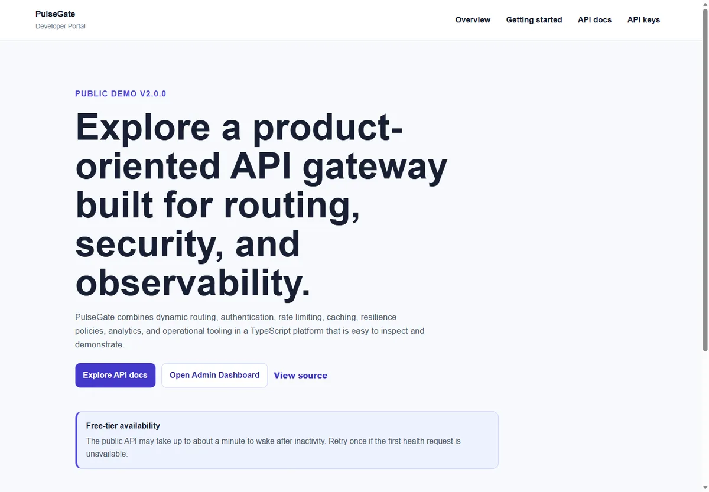
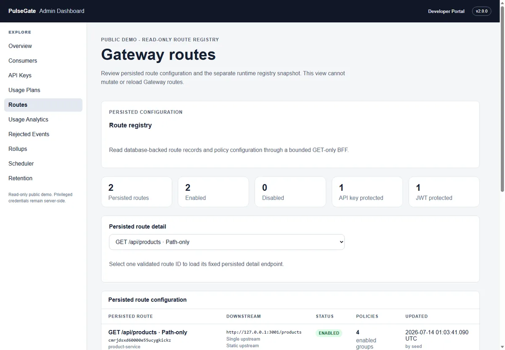
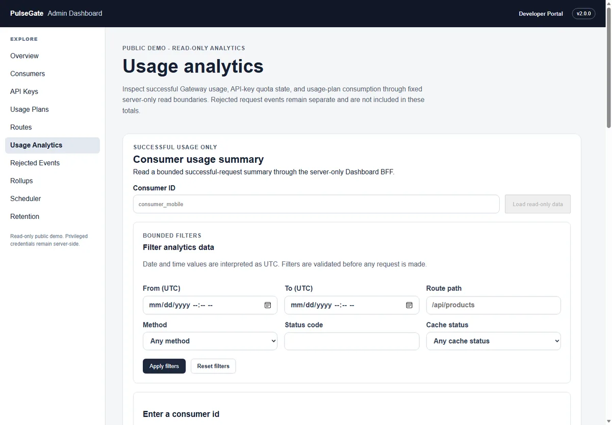
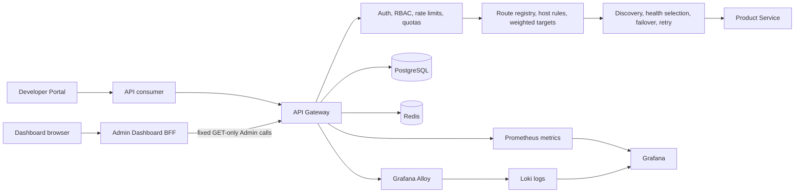

# PulseGate

**A product-oriented API Gateway and observability platform built with TypeScript, Fastify, PostgreSQL, Redis, Next.js, OpenTelemetry, Loki, Prometheus, Grafana, Docker Compose, and Kubernetes.**

[Developer Portal](https://pulsegate-developer-portal.netlify.app) |
[Admin Dashboard](https://pulsegate-admin-dashboard.netlify.app) |
[API health](https://pulsegate-public-demo-api.onrender.com/health) |
[Product Service through Gateway](https://pulsegate-public-demo-api.onrender.com/api/product-service/health) |
[v2.0.0 release notes](docs/releases/v2.0.0.md)

PulseGate demonstrates how an API gateway can combine dynamic routing, authentication, traffic policies, analytics, operations, and observability behind explicit security boundaries. The repository is designed as a portfolio-grade engineering system rather than a production SaaS claim.

> The public demo runs on free-tier infrastructure. The API may take up to about a minute to wake after inactivity. Retry once when the first health request is unavailable.



## What PulseGate demonstrates

| Area | Implemented capabilities |
| --- | --- |
| Gateway runtime | Dynamic route registry, path and host matching, weighted upstreams, service discovery, health-aware failover, bounded retries, request IDs, transforms, timeouts, and downstream proxying |
| Security | Database-backed and environment-fallback API keys, JWT authentication, security headers, request-size limits, rate limiting, quota enforcement, Admin RBAC, and server-only credential boundaries |
| API management | Consumers, API keys, usage plans, route configuration, runtime route inspection, quota state, and fixed read-only Admin Dashboard BFF resources |
| Analytics and operations | Successful usage events, rejected/security events, filtered summaries, raw event inspection, rollup reads, scheduler previews, retention previews, and bounded execution guardrails |
| Observability | Structured logs, trace and span correlation, OpenTelemetry propagation, Grafana Alloy, Loki, Prometheus metrics, provisioned Grafana dashboards, and bounded k6 smoke validation |
| Delivery | npm workspaces, strict TypeScript, Vitest, multi-stage containers, Docker Compose, GitHub Actions, Kubernetes Kustomize overlays, runbooks, decision records, and release evidence |

## Public demo

The public deployment is intentionally separated into two product surfaces:

### Developer Portal

Use the [Developer Portal](https://pulsegate-developer-portal.netlify.app) to:

- Read the public getting-started flow.
- Review curated API documentation.
- Inspect request, response, cache, rate-limit, quota, and downstream error guidance.
- Review the non-operational API-key self-service boundary.
- Navigate to the read-only Admin Dashboard.

The Portal is static-first and unprivileged. It has no developer account, session, billing workflow, secret storage, or privileged Admin API access.

### Admin Dashboard

Use the [Admin Dashboard](https://pulsegate-admin-dashboard.netlify.app) to inspect:

- Consumers and API-key metadata.
- Usage plans and quota summaries.
- Persisted routes and the runtime route registry.
- Host routing, weighted upstream, service discovery, and health metadata.
- Successful usage and rejected/security analytics.
- Persisted rollups, scheduler previews, and retention previews.

The browser calls fixed Dashboard BFF routes. The Dashboard server adds a read-only Admin credential when calling the Gateway. The browser never receives the credential, and the public Dashboard exposes no mutation controls.

<table>
  <tr>
    <td width="50%">
      
    </td>
    <td width="50%">
      
    </td>
  </tr>
</table>

## Architecture



The main runtime path is:

```text
client
  -> API Gateway
  -> request and security boundaries
  -> route registry and target selection
  -> resilience policies
  -> Product Service
  -> usage, rejection, metric, trace, and log evidence
```

## Key engineering decisions

### Read-only public control plane

The public Admin Dashboard uses a server-only read-only credential. It exposes fixed GET-only BFF resources instead of a generic Admin proxy. Full-access Admin credentials remain outside the Dashboard runtime and browser surface.

### Explicit sources of truth

- PostgreSQL stores route configuration, consumers, API keys, usage plans, usage events, rejected events, and analytics rollups.
- Redis backs rate limiting and response caching.
- Raw successful usage events remain the source of truth for usage analytics and quota counting.
- Rejected/security events remain separate from successful usage.
- Rollups are read models and do not replace quota-counting sources.

### Bounded destructive operations

Scheduler and retention functionality is guarded by preview contracts, explicit execution modes, operator confirmation, event limits, bucket bounds, and fail-closed behavior. Public product surfaces expose inspection and previews, not destructive controls.

### Bounded observability

Prometheus labels use bounded route templates. Logs keep correlation identifiers in structured bodies rather than unbounded Loki labels. The included k6 scenario is a lightweight health smoke, not a capacity, soak, SLA, or SLO certification.

## Release and validation

The official Product/Platform v2 release is tagged `v2.0.0` from the final Sprint 80 release commit:

```text
7a3d36574d2400086395d2206c1fa881b874a099
```

Final v2 release validation passed:

| Workspace | Test files | Tests |
| --- | ---: | ---: |
| Admin Dashboard | 55 | 253 |
| API Gateway | 163 | 1177 |
| Developer Portal | 2 | 8 |
| Product Service | 10 | 36 |
| **Total** | **230** | **1474** |

Additional release evidence:

- All workspace typechecks passed.
- All production builds passed.
- Release-readiness and documentation integrity checks passed.
- Docker Compose configuration passed with 10 services.
- All existing Kubernetes Kustomize targets rendered successfully.
- The bounded end-to-end demo passed.
- The bounded k6 smoke passed.
- Runtime cleanup completed without named-volume deletion.

The public demo is deployed from `deploy/public-demo`, which keeps deployment wiring and public UI hardening separate from the protected official `main` release line. The currently verified public demo commit is:

```text
c7a4c70ca7ad6f50b9bedb085c7a799ae6b28459
```

## Technology stack

- **Runtime:** Node.js 20+, TypeScript, Fastify
- **Web applications:** Next.js, React
- **Data:** PostgreSQL, Prisma, Redis
- **Testing:** Vitest, k6
- **Observability:** OpenTelemetry, Prometheus, Grafana Alloy, Loki, Grafana
- **Delivery:** npm workspaces, Docker Compose, GitHub Actions, Kubernetes Kustomize

## Local development

### Prerequisites

- Node.js 20 or newer
- npm
- Docker Desktop with Docker Compose
- PowerShell on Windows for the documented validation workflow

### Install and validate

```powershell
npm.cmd ci
npm.cmd run test
npm.cmd run typecheck
npm.cmd run build
```

### Start the Compose stack

A full local stack requires separate full-access and read-only Admin keys. Configure them according to the [Admin Dashboard runbook](docs/runbooks/admin-dashboard.md), then start Compose:

```powershell
docker compose up -d --build
docker compose ps
```

Local product surfaces:

| Service | URL |
| --- | --- |
| API Gateway | `http://127.0.0.1:3000` |
| Product Service | `http://127.0.0.1:3001` |
| Grafana | `http://127.0.0.1:3002` |
| Admin Dashboard | `http://127.0.0.1:3003` |
| Developer Portal | `http://127.0.0.1:3004` |
| Prometheus | `http://127.0.0.1:9090` |

Keep credentials out of source code and browser-visible environment variables.

### Run the bounded end-to-end demo and smoke

```powershell
powershell.exe `
  -NoProfile `
  -ExecutionPolicy Bypass `
  -File scripts/demo-runtime.ps1 `
  -ArtifactDirectory E:\pulsegate-artifacts\demo

npm.cmd run test:k6:smoke
```

The k6 test is intentionally small and bounded.

## Repository guide

| Path | Purpose |
| --- | --- |
| `apps/api-gateway` | Gateway runtime, Admin APIs, routing, traffic policies, analytics, and database integration |
| `apps/product-service` | Downstream service used by the gateway demo |
| `apps/admin-dashboard` | Read-only operational control plane |
| `apps/developer-portal` | Public developer-facing product surface |
| `deploy/kubernetes` | Base manifests and local Kustomize overlays |
| `deploy/public-demo` | Public demo runtime packaging |
| `observability` | Prometheus, Grafana, Loki, Alloy, and k6 assets |
| `docs/architecture` | Architecture and runtime boundaries |
| `docs/runbooks` | Local validation and operational procedures |
| `docs/project-context/decisions` | Architecture and product decision records |
| `docs/sdlc/sprint-history` | Historical delivery evidence |

## Documentation

Start with:

- [Architecture overview](docs/architecture/overview.md)
- [Current canonical state](docs/project-context/CURRENT_PROGRESS.md)
- [Product/Platform v2 release notes](docs/releases/v2.0.0.md)
- [Final requirements](docs/sdlc/requirements.md)
- [Local validation runbook](docs/runbooks/local-validation.md)
- [Admin Dashboard runbook](docs/runbooks/admin-dashboard.md)
- [Developer Portal runbook](docs/runbooks/developer-portal.md)
- [End-to-end demo and k6 runbook](docs/runbooks/end-to-end-demo-and-k6.md)
- [Observability validation runbook](docs/runbooks/observability-validation.md)

## Scope boundaries

PulseGate is an engineering portfolio platform and public demonstration. It does not claim:

- Production capacity, high availability, SLA, or SLO certification.
- Enterprise compliance certification.
- Complete production multi-tenancy or billing.
- A public developer identity and ownership system.
- Browser-based issuance of real API keys.
- A canonical generated OpenAPI reference.
- Production secret management for the local Kubernetes overlay.
- Destructive retention controls in the public Dashboard.

The fixed Sprint 45-80 roadmap is complete. No Sprint 81 is defined.

## License

No license file is currently included. All rights are reserved unless a license is added explicitly.
