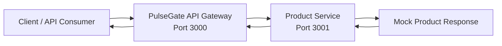

# PulseGate

<p align="center">
  <strong>High-Traffic API Gateway & Observability Platform</strong>
</p>

<p align="center">
  A local-first API Gateway, API Management, and Observability learning project built with Node.js, TypeScript, Fastify, and a microservice-oriented architecture.
</p>

<p align="center">
  
  
  
  
  
  
</p>

---

## Overview

**PulseGate** is a mini API Gateway + API Management + Observability Platform inspired by:

* Kong
* Apache APISIX
* Tyk
* Apigee
* AWS API Gateway

The project is designed to demonstrate backend engineering skills around API routing, microservice communication, request tracing, observability, scalability, and production-oriented system design.

PulseGate starts small and grows step by step.

Current Sprint 0 focuses on the smallest working flow:

```txt
Client
  -> API Gateway :3000
    -> Product Service :3001
      -> Response
```

---

## Why PulseGate?

Modern backend systems often contain many services. Without an API Gateway, clients may need to call each service directly, which creates problems around routing, security, rate limiting, logging, monitoring, and scaling.

PulseGate aims to solve these problems by acting as a single entry point for APIs.

Long-term goals:

* Route requests to the correct backend service.
* Validate API keys and JWT tokens.
* Apply rate limiting to protect services.
* Add Redis caching to reduce backend load.
* Log requests with request IDs.
* Expose metrics for monitoring.
* Add distributed tracing.
* Stream events with Kafka.
* Process background jobs with RabbitMQ.
* Run load tests with k6.
* Support Docker Compose and later Kubernetes.
* Provide an Admin Dashboard and Developer Portal later.

---

## Current Features

### Sprint 0 Features

* API Gateway running on port `3000`.
* Product Service running on port `3001`.
* Gateway route: `GET /api/products`.
* Product Service route: `GET /products`.
* Health check APIs.
* Request ID generation.
* Request ID propagation from Gateway to Product Service.
* JSON logging.
* Basic 404 error handling.
* Basic 500 error handling.
* TypeScript strict mode.
* npm workspaces monorepo.
* Clean service structure with config, routes, and middlewares.
* Project context documentation.
* Architecture documentation.
* Requirements documentation.

---

## Current Architecture



Current request flow:

```txt
GET http://localhost:3000/api/products

Client
  -> API Gateway
    -> GET http://127.0.0.1:3001/products
      -> Product Service
        -> Products response
    -> API Gateway
  -> Client
```

---

## Monorepo Structure

```txt
pulsegate/
  apps/
    api-gateway/
      src/
        config/
          env.ts
        middlewares/
          error-handler.middleware.ts
          request-id.middleware.ts
        routes/
          health.route.ts
          product-proxy.route.ts
        server.ts
      package.json
      tsconfig.json

    product-service/
      src/
        config/
          env.ts
        middlewares/
          error-handler.middleware.ts
          request-id.middleware.ts
        routes/
          health.route.ts
          product.route.ts
        server.ts
      package.json
      tsconfig.json

  packages/
    shared/
      src/
        errors/
        types/

  docs/
    architecture/
      overview.md
    sdlc/
      requirements.md
    project-context/
      AI_HANDOFF.md
      CURRENT_PROGRESS.md
      DECISION_LOG.md

  infra/

  .gitattributes
  .gitignore
  package.json
  package-lock.json
  README.md
```

---

## Services

### API Gateway

Location:

```txt
apps/api-gateway
```

Port:

```txt
3000
```

Endpoints:

```txt
GET /health
GET /api/products
```

Responsibilities:

* Acts as the single entry point.
* Receives client requests.
* Creates or reuses request IDs.
* Adds `x-request-id` response header.
* Routes product API requests to Product Service.
* Forwards `x-request-id` to downstream services.
* Handles basic 404 and 500 errors.
* Logs requests in JSON format.

---

### Product Service

Location:

```txt
apps/product-service
```

Port:

```txt
3001
```

Endpoints:

```txt
GET /health
GET /products
```

Responsibilities:

* Provides product-related APIs.
* Returns mock product data in Sprint 0.
* Creates or reuses request IDs.
* Reuses request ID from API Gateway.
* Handles basic 404 and 500 errors.
* Logs requests in JSON format.

---

## Tech Stack

Currently implemented:

| Category      | Technology                 |
| ------------- | -------------------------- |
| Runtime       | Node.js                    |
| Language      | TypeScript                 |
| Web Framework | Fastify                    |
| Monorepo      | npm workspaces             |
| Logging       | Fastify JSON logger        |
| Architecture  | API Gateway + Microservice |

Planned later:

| Category         | Technology                   |
| ---------------- | ---------------------------- |
| Database         | PostgreSQL                   |
| ORM              | Prisma                       |
| Cache            | Redis                        |
| Event Streaming  | Kafka                        |
| Background Jobs  | RabbitMQ                     |
| Metrics          | Prometheus                   |
| Dashboard        | Grafana                      |
| Tracing          | OpenTelemetry + Jaeger/Tempo |
| Logs             | Loki                         |
| Load Testing     | k6                           |
| Containerization | Docker, Docker Compose       |
| Orchestration    | Kubernetes                   |
| CI/CD            | GitHub Actions               |

---

## Getting Started

### 1. Clone the repository

```powershell
git clone https://github.com/VuNguyen26/pulsegate.git
cd pulsegate
```

### 2. Install dependencies

```powershell
npm install
```

### 3. Run Product Service

Open terminal 1:

```powershell
npm run dev:product
```

Product Service runs on:

```txt
http://localhost:3001
```

### 4. Run API Gateway

Open terminal 2:

```powershell
npm run dev:gateway
```

API Gateway runs on:

```txt
http://localhost:3000
```

---

## Test APIs

### Product Service Health Check

```powershell
Invoke-RestMethod http://localhost:3001/health | ConvertTo-Json -Depth 10
```

Expected response:

```json
{
  "service": "product-service",
  "status": "ok",
  "timestamp": "2026-06-25T00:00:00.000Z"
}
```

### Product Service Products API

```powershell
Invoke-RestMethod http://localhost:3001/products | ConvertTo-Json -Depth 10
```

### API Gateway Health Check

```powershell
Invoke-RestMethod http://localhost:3000/health | ConvertTo-Json -Depth 10
```

Expected response:

```json
{
  "service": "api-gateway",
  "status": "ok",
  "timestamp": "2026-06-25T00:00:00.000Z"
}
```

### API Gateway Product Proxy API

```powershell
Invoke-RestMethod http://localhost:3000/api/products | ConvertTo-Json -Depth 10
```

Expected response:

```json
{
  "data": [
    {
      "id": "prod_001",
      "name": "Mechanical Keyboard",
      "price": 120
    },
    {
      "id": "prod_002",
      "name": "Gaming Mouse",
      "price": 45
    }
  ]
}
```

---

## Request ID Propagation

PulseGate supports request ID propagation from the beginning.

Current behavior:

```txt
Client
  -> API Gateway creates or reuses x-request-id
  -> API Gateway returns x-request-id in response header
  -> API Gateway forwards x-request-id to Product Service
  -> Product Service reuses the same request ID
```

Why this matters:

* Easier debugging.
* Better request tracking.
* Foundation for distributed tracing.
* Helps connect logs across services.

---

## Development Commands

Run API Gateway:

```powershell
npm run dev:gateway
```

Run Product Service:

```powershell
npm run dev:product
```

Typecheck all workspaces:

```powershell
npm run typecheck
```

Build all workspaces:

```powershell
npm run build
```

---

## Documentation

Project documentation is stored in the `docs` folder.

| Document                                   | Description                                    |
| ------------------------------------------ | ---------------------------------------------- |
| `docs/architecture/overview.md`            | Current and future architecture overview       |
| `docs/sdlc/requirements.md`                | Functional and non-functional requirements     |
| `docs/project-context/CURRENT_PROGRESS.md` | Current project progress                       |
| `docs/project-context/DECISION_LOG.md`     | Technical decision records                     |
| `docs/project-context/AI_HANDOFF.md`       | Context file for continuing with AI assistance |

---

## Roadmap

### Sprint 0 - Core Setup & Basic Gateway Flow

Status: In progress

* [x] Create GitHub repository.
* [x] Set up npm workspaces.
* [x] Set up TypeScript.
* [x] Create API Gateway.
* [x] Create Product Service.
* [x] Add basic Gateway to Product Service flow.
* [x] Add health check APIs.
* [x] Add request ID handling.
* [x] Add JSON logger.
* [x] Add basic error handlers.
* [x] Refactor API Gateway structure.
* [x] Refactor Product Service structure.
* [x] Add project context docs.
* [x] Add architecture overview.
* [x] Add requirements document.
* [ ] Improve README.
* [ ] Add `.env.example`.

### Sprint 1 - API Gateway Core Features

Planned:

* [ ] Add API key authentication.
* [ ] Add JWT authentication.
* [ ] Add route configuration.
* [ ] Add request timeout handling.
* [ ] Add downstream service error normalization.
* [ ] Add basic unit tests.
* [ ] Add integration tests.

### Sprint 2 - Traffic Control & Caching

Planned:

* [ ] Add Redis.
* [ ] Add rate limiting.
* [ ] Add response caching.
* [ ] Add cache TTL.
* [ ] Add cache hit/miss logging.

### Sprint 3 - Data & Infrastructure

Planned:

* [ ] Add PostgreSQL.
* [ ] Add Prisma.
* [ ] Replace mock product data with database data.
* [ ] Add Docker Compose.
* [ ] Containerize API Gateway.
* [ ] Containerize Product Service.

### Sprint 4 - Observability

Planned:

* [ ] Add Prometheus metrics.
* [ ] Add Grafana dashboard.
* [ ] Add OpenTelemetry.
* [ ] Add Jaeger or Tempo.
* [ ] Add structured log pipeline later.

### Sprint 5 - Event-Driven Architecture

Planned:

* [ ] Add Kafka event streaming.
* [ ] Add RabbitMQ background jobs.
* [ ] Add Notification Service.
* [ ] Add async processing examples.

### Future

Planned:

* [ ] Admin Dashboard.
* [ ] Developer Portal.
* [ ] k6 load testing.
* [ ] GitHub Actions CI/CD.
* [ ] Kubernetes deployment.
* [ ] Cloud lightweight demo.

---

## Current Status

PulseGate currently has a working local API Gateway flow.

Stable flow:

```txt
Client
  -> API Gateway :3000
    -> Product Service :3001
      -> Mock Product Response
```

Latest stable commits:

```txt
5d247cc feat: setup basic gateway to product service flow
207616a refactor: split api gateway routes config and middlewares
3ae7802 refactor: split product service routes config and middlewares
c0615fe docs: add project context handoff and progress logs
71923ae docs: add architecture overview and requirements
```

---

## Project Principles

PulseGate follows these principles:

* Local-first.
* Cloud-optional.
* Cost-safe.
* Small steps before complex infrastructure.
* Clean architecture before scaling.
* Observability from the beginning.
* Production-oriented learning.
* GitHub-ready documentation.

---

## License

This project is licensed under the MIT License.
