# PulseGate Architecture Overview

## 1. Project Overview

PulseGate is a High-Traffic API Gateway & Observability Platform.

The long-term goal is to build a mini API Gateway and API Management system inspired by:

* Kong
* Apache APISIX
* Tyk
* Apigee
* AWS API Gateway

PulseGate is designed to help backend teams manage, protect, monitor, and scale APIs in a microservice environment.

Current version:

```txt
v0.3.0
```

Current status:

```txt
Sprint 2 - Gateway Traffic Protection Complete
```

---

## 2. Target Users

PulseGate is designed for:

* Backend Developers
* DevOps Engineers
* SREs
* Tech Leads
* Companies with multiple internal or external APIs

---

## 3. Problems PulseGate Solves

PulseGate aims to solve these problems:

* Provide a single entry point for multiple backend services.
* Route client requests to the correct downstream service.
* Centralize authentication and authorization.
* Protect APIs from spam, abuse, excessive traffic, and unsafe payloads.
* Reduce backend load with caching in later sprints.
* Add request logging for debugging.
* Add metrics for monitoring in later sprints.
* Add distributed tracing for understanding request flow in later sprints.
* Support event streaming and background jobs in later phases.
* Provide a foundation for future API management features.

---

## 4. Current Architecture

Current stable architecture after Sprint 2:

```txt
Client
  -> API Gateway :3000
    -> Request ID handling
    -> Basic security headers
    -> Request size limit
    -> API key authentication for protected routes
    -> In-memory rate limiting by API key and route
    -> JWT authentication for protected routes
    -> Downstream route configuration
    -> Downstream timeout handling
    -> Normalized downstream error handling
    -> Product Service :3001
      -> Mock product response
```

Current architecture diagram:

```mermaid
flowchart LR
    Client[Client / API Consumer] --> Gateway[PulseGate API Gateway<br/>Port 3000]
    Gateway --> ReqId[Request ID Middleware]
    ReqId --> SecurityHeaders[Security Headers Middleware]
    SecurityHeaders --> SizeLimit[Request Size Limit]
    SizeLimit --> ApiKey[API Key Authentication]
    ApiKey --> RateLimit[In-Memory Rate Limiting]
    RateLimit --> Jwt[JWT Authentication]
    Jwt --> RouteConfig[Downstream Route Config]
    RouteConfig --> Product[Product Service<br/>Port 3001]
    Product --> Response[Mock Product Response]
    Response --> Product
    Product --> Gateway
    Gateway --> Client
```



Current behavior:

1. Client sends a request to API Gateway.
2. API Gateway creates or reuses a request ID.
3. API Gateway adds baseline security headers.
4. API Gateway checks request body size.
5. API Gateway checks API key for protected routes.
6. API Gateway applies rate limiting for protected routes.
7. API Gateway checks JWT for protected routes.
8. API Gateway uses route config to determine downstream service information.
9. API Gateway calls Product Service.
10. API Gateway forwards the same `x-request-id` header.
11. Product Service receives the request.
12. Product Service reuses the same request ID.
13. Product Service returns mock product data.
14. API Gateway normalizes downstream errors when needed.
15. API Gateway returns the response to the client.

---

## 5. Current Services

### 5.1 API Gateway

Location:

```txt
apps/api-gateway
```

Port:

```txt
3000
```

Current endpoints:

```txt
GET /health
GET /api/products
```

Route protection:

```txt
GET /health
  -> Public

GET /api/products
  -> Requires API key
  -> Rate limited by API key and route
  -> Requires JWT Bearer token
```

Responsibilities:

* Acts as the single entry point for clients.
* Receives client requests.
* Generates or reuses request ID.
* Adds `x-request-id` response header.
* Adds basic security headers.
* Applies request size limit.
* Routes `/api/products` to Product Service.
* Forwards `x-request-id` to downstream service.
* Applies API key authentication.
* Applies in-memory rate limiting.
* Applies JWT authentication.
* Attaches verified JWT payload to `request.jwtPayload`.
* Uses downstream route configuration.
* Uses route-level auth configuration.
* Uses route-level rate limit configuration.
* Applies downstream request timeout.
* Normalizes downstream service errors.
* Handles basic 404 errors.
* Handles basic 500 errors.
* Logs requests in JSON format.
* Supports automated integration tests using Fastify `app.inject()`.

Current structure:

```txt
apps/api-gateway/src/
  app.ts
  app.test.ts
  config/
    downstream-routes.ts
    downstream-routes.test.ts
    env.ts
    env.test.ts
  errors/
    downstream-service-error.ts
    downstream-service-error.test.ts
  middlewares/
    api-key-auth.middleware.ts
    api-key-auth.middleware.test.ts
    error-handler.middleware.ts
    jwt-auth.middleware.ts
    jwt-auth.middleware.test.ts
    rate-limit.middleware.ts
    rate-limit.middleware.test.ts
    request-id.middleware.ts
    request-id.middleware.test.ts
    request-size-limit.middleware.ts
    request-size-limit.middleware.test.ts
    security-headers.middleware.ts
    security-headers.middleware.test.ts
  rate-limit/
    in-memory-rate-limit-store.ts
    in-memory-rate-limit-store.test.ts
  routes/
    health.route.ts
    product-proxy.route.ts
  server.ts
```

---

### 5.2 Product Service

Location:

```txt
apps/product-service
```

Port:

```txt
3001
```

Current endpoints:

```txt
GET /health
GET /products
```

Responsibilities:

* Provides product-related APIs.
* Returns mock product data.
* Generates or reuses request ID.
* Reuses request ID from API Gateway.
* Handles basic 404 errors.
* Handles basic 500 errors.
* Logs requests in JSON format.

Current structure:

```txt
apps/product-service/src/
  config/
    env.ts
  middlewares/
    error-handler.middleware.ts
    request-id.middleware.ts
  routes/
    health.route.ts
    product.route.ts
  server.ts
```

---

## 6. Current Request Flow

### 6.1 API Gateway Health Check Flow

```txt
Client
  -> GET http://localhost:3000/health
    -> API Gateway creates or reuses x-request-id
    -> API Gateway adds basic security headers
    -> API Gateway applies request size limit
    -> API Gateway returns health response
```

Expected response:

```json
{
  "service": "api-gateway",
  "status": "ok",
  "timestamp": "2026-06-25T00:00:00.000Z"
}
```

### 6.2 Product Service Health Check Flow

```txt
Client
  -> GET http://localhost:3001/health
    -> Product Service
      -> Response
```

Expected response:

```json
{
  "service": "product-service",
  "status": "ok",
  "timestamp": "2026-06-25T00:00:00.000Z"
}
```

### 6.3 Protected Product API Flow

```txt
Client
  -> GET http://localhost:3000/api/products
    -> API Gateway creates or reuses x-request-id
    -> API Gateway adds basic security headers
    -> API Gateway applies request size limit
      -> If request body is too large:
        -> 413 REQUEST_BODY_TOO_LARGE
    -> API Gateway checks x-api-key
      -> If missing:
        -> 401 API_KEY_MISSING
      -> If invalid:
        -> 403 API_KEY_INVALID
      -> If valid:
        -> API Gateway applies rate limit by API key and route
          -> If exceeded:
            -> 429 TOO_MANY_REQUESTS
          -> If allowed:
            -> API Gateway checks Authorization Bearer token
              -> If missing:
                -> 401 JWT_TOKEN_MISSING
              -> If invalid:
                -> 403 JWT_TOKEN_INVALID
              -> If valid:
                -> API Gateway calls Product Service
                  -> GET http://127.0.0.1:3001/products
                -> Product Service returns mock product data
    -> API Gateway returns response to Client
```

Expected response:

```json
{
  "data": [
    {
      "id": "prod_001",
      "name": "Mechanical Keyboard",
      "price": 120
    },
    {
      "id": "prod_002",
      "name": "Gaming Mouse",
      "price": 45
    }
  ]
}
```

---

## 7. Request ID Design

PulseGate uses request IDs from the beginning.

Purpose:

* Make debugging easier.
* Connect logs across services.
* Prepare for distributed tracing.
* Prepare for observability tools later.

Current request ID flow:

```txt
Client request
  -> API Gateway creates or reuses x-request-id
  -> API Gateway returns x-request-id in response header
  -> API Gateway forwards x-request-id to Product Service
  -> Product Service reuses the same request ID
```

Current request ID header:

```txt
x-request-id
```

---

## 8. Authentication Design

### 8.1 API Key Authentication

API key authentication is used for client or application-level authentication.

Protected route:

```txt
GET /api/products
```

Default header:

```txt
x-api-key
```

Default local API key:

```txt
dev-api-key
```

Behavior:

```txt
Missing API key
  -> 401 API_KEY_MISSING

Invalid API key
  -> 403 API_KEY_INVALID

Valid API key
  -> Continue to route-level rate limiting
```

---

### 8.2 JWT Authentication

JWT authentication is used for user or session-level authentication.

Protected route:

```txt
GET /api/products
```

Default header:

```txt
Authorization: Bearer <jwt-token>
```

Default local JWT configuration:

```txt
JWT_SECRET=local-dev-jwt-secret-change-me
JWT_ISSUER=pulsegate-api-gateway
JWT_AUDIENCE=pulsegate-clients
JWT_EXPIRES_IN_SECONDS=900
```

JWT validation checks:

```txt
Signature
Issuer
Audience
Expiration
```

Behavior:

```txt
Missing Bearer token
  -> 401 JWT_TOKEN_MISSING

Invalid Bearer token
  -> 403 JWT_TOKEN_INVALID

Valid Bearer token
  -> Continue to Product Service
```

Verified JWT payload is attached to:

```txt
request.jwtPayload
```

---

## 9. Traffic Protection Design

### 9.1 In-Memory Rate Limiting

PulseGate currently supports in-memory rate limiting for:

```txt
GET /api/products
```

Current behavior:

```txt
Allowed requests within the window
  -> Continue to JWT authentication

Exceeded rate limit
  -> 429 TOO_MANY_REQUESTS
```

Default local rate limit:

```txt
5 requests per 60 seconds
```

Rate limit identity:

```txt
API key + HTTP method + route path
```

Current rate limit key shape:

```txt
api-key:<api-key>:route:<method>:<route-path>
```

Example:

```txt
api-key:dev-api-key:route:GET:/api/products
```

Current rate limit response headers:

```txt
x-ratelimit-limit
x-ratelimit-remaining
x-ratelimit-reset
retry-after
```

Expected response when exceeded:

```json
{
  "error": {
    "code": "TOO_MANY_REQUESTS",
    "message": "Too many requests. Please try again later.",
    "requestId": "example-request-id"
  }
}
```

Expected status:

```txt
429
```

Current limitation:

* Counters are stored in API Gateway memory.
* Counters reset when the API Gateway process restarts.
* Counters are not shared across multiple Gateway instances.
* Redis-backed distributed rate limiting is planned for a later sprint.

---

### 9.2 Request Size Limit

PulseGate currently applies request size protection at the API Gateway level.

Current config:

```txt
MAX_REQUEST_BODY_BYTES=1048576
```

That equals:

```txt
1MB
```

Current behavior:

```txt
Content-Length <= MAX_REQUEST_BODY_BYTES
  -> Continue request flow

Content-Length > MAX_REQUEST_BODY_BYTES
  -> 413 REQUEST_BODY_TOO_LARGE
```

Expected response:

```json
{
  "error": {
    "code": "REQUEST_BODY_TOO_LARGE",
    "message": "Request body is too large",
    "requestId": "example-request-id"
  }
}
```

Expected status:

```txt
413
```

Implementation notes:

* Request size limit middleware checks `content-length`.
* Fastify `bodyLimit` is configured with `MAX_REQUEST_BODY_BYTES`.

---

### 9.3 Basic Security Headers

PulseGate currently adds baseline security headers to API Gateway responses.

Current security headers:

```txt
x-content-type-options: nosniff
x-frame-options: DENY
referrer-policy: no-referrer
permissions-policy: camera=(), microphone=(), geolocation=()
content-security-policy: default-src 'none'; frame-ancestors 'none'; base-uri 'none'
```

Not included yet:

```txt
strict-transport-security
```

Reason:

* The project is still local-first and uses HTTP in local development.
* HSTS should be added when HTTPS deployment is introduced.

---

## 10. Downstream Resilience Design

PulseGate normalizes downstream Product Service failures.

Current downstream failure behavior:

```txt
Product Service unavailable
  -> 503 DOWNSTREAM_SERVICE_UNAVAILABLE

Product Service timeout
  -> 504 DOWNSTREAM_TIMEOUT

Product Service returns error status
  -> 502 DOWNSTREAM_HTTP_ERROR

Product Service returns invalid JSON
  -> 502 DOWNSTREAM_INVALID_RESPONSE
```

Example unavailable response:

```json
{
  "error": {
    "code": "DOWNSTREAM_SERVICE_UNAVAILABLE",
    "message": "Product Service is currently unavailable",
    "service": "product-service",
    "requestId": "example-request-id"
  }
}
```

---

## 11. Route Configuration Design

Current route config file:

```txt
apps/api-gateway/src/config/downstream-routes.ts
```

Current product route config includes:

```txt
serviceName
gatewayPath
downstreamUrl
method
timeoutMs
auth
rateLimit
```

Current product route auth config:

```txt
GET /api/products
  -> requireApiKey: true
  -> requireJwt: true
```

Current product route rate limit config:

```txt
GET /api/products
  -> limit: PRODUCT_PRODUCTS_RATE_LIMIT_MAX_REQUESTS
  -> windowMs: PRODUCT_PRODUCTS_RATE_LIMIT_WINDOW_MS
```

Purpose:

* Keep route behavior configuration close to route definitions.
* Avoid hard-coding all Gateway behavior directly in route handlers.
* Prepare for future route-level policies.
* Prepare for more downstream services later.

---

## 12. Current Tech Stack

Currently implemented:

* Node.js
* TypeScript
* Fastify
* npm workspaces
* Vitest
* jose

Currently implemented Gateway capabilities:

* Request ID propagation.
* JSON logging.
* API key authentication.
* JWT authentication.
* Downstream route configuration.
* Downstream timeout handling.
* Normalized downstream error handling.
* In-memory rate limiting.
* Request size limit.
* Basic security headers.
* Unit tests.
* Integration tests.

Not implemented yet:

* PostgreSQL
* Prisma
* Redis
* Kafka
* RabbitMQ
* Docker
* Docker Compose
* Kubernetes
* Prometheus
* Grafana
* OpenTelemetry
* Jaeger or Tempo
* Loki
* k6
* Admin Dashboard
* Developer Portal

---

## 13. Monorepo Structure

Current repository structure:

```txt
pulsegate/
  apps/
    api-gateway/
      src/
        app.ts
        app.test.ts
        config/
          downstream-routes.ts
          downstream-routes.test.ts
          env.ts
          env.test.ts
        errors/
          downstream-service-error.ts
          downstream-service-error.test.ts
        middlewares/
          api-key-auth.middleware.ts
          api-key-auth.middleware.test.ts
          error-handler.middleware.ts
          jwt-auth.middleware.ts
          jwt-auth.middleware.test.ts
          rate-limit.middleware.ts
          rate-limit.middleware.test.ts
          request-id.middleware.ts
          request-id.middleware.test.ts
          request-size-limit.middleware.ts
          request-size-limit.middleware.test.ts
          security-headers.middleware.ts
          security-headers.middleware.test.ts
        rate-limit/
          in-memory-rate-limit-store.ts
          in-memory-rate-limit-store.test.ts
        routes/
          health.route.ts
          product-proxy.route.ts
        server.ts
      package.json
      tsconfig.json
      vitest.config.ts

    product-service/
      src/
        config/
          env.ts
        middlewares/
          error-handler.middleware.ts
          request-id.middleware.ts
        routes/
          health.route.ts
          product.route.ts
        server.ts
      package.json
      tsconfig.json

  packages/
    shared/
      src/
        errors/
        types/

  docs/
    architecture/
      overview.md
    sdlc/
      requirements.md
    project-context/
      AI_HANDOFF.md
      CURRENT_PROGRESS.md
      DECISION_LOG.md

  infra/

  .env.example
  .gitattributes
  .gitignore
  package.json
  package-lock.json
  README.md
```

---

## 14. Automated Test Architecture

PulseGate uses Vitest for API Gateway unit and integration tests.

Current test command:

```powershell
npm run test
```

Current test status:

```txt
11 test files passed
71 tests passed
```

Current unit test coverage:

```txt
request-id.middleware.test.ts
  -> Request ID generation and reuse

api-key-auth.middleware.test.ts
  -> Missing, invalid, valid, and array header API key cases

jwt-auth.middleware.test.ts
  -> Bearer token extraction, JWT verification, missing token, invalid token, valid token

in-memory-rate-limit-store.test.ts
  -> In-memory rate limit store behavior, counters, window reset, cleanup, validation

rate-limit.middleware.test.ts
  -> Rate limit key generation, allowed requests, exceeded limit, reset behavior, missing identifier

request-size-limit.middleware.test.ts
  -> Content-Length parsing, allowed body size, exceeded body size, invalid config

security-headers.middleware.test.ts
  -> Basic security headers

downstream-service-error.test.ts
  -> DownstreamServiceError and type guard behavior

env.test.ts
  -> Number, CSV, and string env parsing

downstream-routes.test.ts
  -> Route-level rate limit config and auth requirements
```

Current integration test coverage:

```txt
GET /health
  -> 200 OK
  -> includes x-request-id
  -> includes basic security headers

POST /api/products with oversized content-length
  -> 413 REQUEST_BODY_TOO_LARGE

GET /api/products without API key
  -> 401 API_KEY_MISSING

GET /api/products with invalid API key
  -> 403 API_KEY_INVALID

GET /api/products with valid API key but missing JWT
  -> 401 JWT_TOKEN_MISSING

GET /api/products with valid API key but invalid JWT
  -> 403 JWT_TOKEN_INVALID

GET /api/products with valid API key and valid JWT
  -> 200 and product data
  -> includes rate limit headers

GET /api/products when rate limit is exceeded
  -> 429 TOO_MANY_REQUESTS
  -> does not call Product Service for the blocked request

GET /api/products with valid API key and valid JWT but downstream unavailable
  -> 503 DOWNSTREAM_SERVICE_UNAVAILABLE

GET /api/products with valid API key and valid JWT but downstream returns 500
  -> 502 DOWNSTREAM_HTTP_ERROR

GET /api/products with valid API key and valid JWT but downstream returns invalid JSON
  -> 502 DOWNSTREAM_INVALID_RESPONSE

GET /api/products with valid API key and valid JWT but downstream times out
  -> 504 DOWNSTREAM_TIMEOUT
```

---

## 15. Current Design Principles

PulseGate follows these principles:

### 15.1 Local First

The project should run locally before adding cloud deployment.

### 15.2 Cost Safe

Early versions should not require paid cloud infrastructure.

### 15.3 Small Steps

New technologies should be added only after the previous layer is stable.

### 15.4 Clean Structure

Each service should separate:

* Config
* Routes
* Middlewares
* Errors
* Tests
* Server startup

### 15.5 Observable by Design

Request ID and JSON logging are added early to prepare for future observability.

### 15.6 Behavior First, Infrastructure Later

Gateway behavior should be implemented and tested before adding Redis, Docker, databases, Kafka, or observability infrastructure.

### 15.7 Test Before Scaling

Core Gateway behavior should be protected by automated tests before infrastructure and distributed systems are added.

---

## 16. Future Target Architecture

Long-term architecture:

```txt
Client / Frontend / External API Consumer
  -> PulseGate API Gateway
    -> Auth Service
    -> Product Service
    -> Order Service
    -> Payment Service
    -> Notification Service

Services
  -> PostgreSQL
  -> Redis
  -> Kafka
  -> RabbitMQ

Observability
  -> Prometheus
  -> Grafana
  -> OpenTelemetry
  -> Jaeger or Tempo
  -> Loki

Infrastructure
  -> Docker Compose for local development
  -> Kubernetes later
  -> CI/CD with GitHub Actions
```

---

## 17. Planned Evolution

### Sprint 0 - Core Setup & Basic Gateway Flow

Goal:

* Set up repository.
* Set up TypeScript.
* Run API Gateway.
* Run Product Service.
* Route request from Gateway to Product Service.
* Add basic request ID, logging, health check, and error handling.
* Add initial documentation.

Status:

```txt
Done
```

---

### Sprint 1 - API Gateway Core Features

Goal:

* Normalize downstream service errors.
* Add downstream request timeout.
* Add downstream route configuration foundation.
* Add API key authentication.
* Add JWT authentication.
* Add unit tests.
* Add integration tests.

Status:

```txt
Done
```

---

### Sprint 2 - Gateway Traffic Protection

Goal:

* Add in-memory rate limiting foundation.
* Add route-level rate limit configuration.
* Add rate limit response behavior.
* Add request size limit.
* Add basic security headers.
* Add route-level auth configuration refinement.
* Add traffic protection tests.

Status:

```txt
Done
```

---

### Sprint 3 - Data & Infrastructure Foundation

Planned goal:

* Add Docker Compose foundation.
* Add PostgreSQL service.
* Add Product Service database foundation.
* Add Prisma.
* Replace mock product data with database-backed product data.
* Add Redis service.
* Upgrade rate limiting from in-memory store to Redis-backed store.
* Add basic response caching.

Status:

```txt
Planned
```

---

### Sprint 4 - Observability

Planned goal:

* Add Prometheus metrics.
* Add Grafana dashboard.
* Add OpenTelemetry.
* Add Jaeger or Tempo.
* Add structured log pipeline later.

Status:

```txt
Planned
```

---

### Sprint 5 - Event-Driven Architecture

Planned goal:

* Add Kafka event streaming.
* Add RabbitMQ background jobs.
* Add Notification Service.
* Add async processing examples.

Status:

```txt
Planned
```

---

### Future

Planned features:

* Admin Dashboard.
* Developer Portal.
* k6 load testing.
* GitHub Actions CI/CD.
* Kubernetes deployment.
* Cloud lightweight demo.

Status:

```txt
Future
```
