# PulseGate Architecture Overview

## 1. Project Overview

PulseGate is a High-Traffic API Gateway & Observability Platform.

The long-term goal is to build a mini API Gateway and API Management system inspired by:

* Kong
* Apache APISIX
* Tyk
* Apigee
* AWS API Gateway

PulseGate is designed to help backend teams manage, protect, monitor, validate, and scale APIs in a microservice environment.

Current version:

```txt
v0.13.0
```

Current status:

```txt
Sprint 12 - Catch-All Dynamic Router Foundation Complete
```

Current automated test status:

```txt
29 test files passed
190 tests passed
```

Current CI/CD status:

```txt
GitHub Actions CI -> passing
README CI badge -> passing
```

Current architecture level:

```txt
Local-first API Gateway
Docker Compose infrastructure
PostgreSQL-backed Product Service
PostgreSQL-backed API Gateway route configuration
Internal/admin route management API foundation
Route management hardening with soft delete
Runtime route registry snapshot foundation
Runtime route registry status endpoint
Runtime route registry refresh through reload endpoint
Catch-all dynamic router for /api/*
No-restart runtime apply for brand-new DB-backed /api/* paths
Admin API key authentication for internal/admin APIs
Redis-backed traffic protection and response cache
Prometheus + Grafana observability
Route policy foundation
GitHub Actions CI/CD foundation
Database-backed dynamic Gateway route config
Soft-delete-aware active route loading
Safe static route config fallback
Honest reload response metadata
```

---

## 2. Target Users

PulseGate is designed for:

* Backend Developers
* DevOps Engineers
* SREs
* Tech Leads
* Companies with multiple internal or external APIs
* Teams that need a centralized API entry point
* Teams that want API Gateway, API Management, and Observability concepts in one platform

---

## 3. Problems PulseGate Solves

PulseGate currently solves or prepares for these problems:

* Provide a single entry point for multiple backend services.
* Route client requests to the correct downstream service.
* Support more than one Gateway route.
* Allow public routes and protected routes to behave differently.
* Centralize authentication and authorization.
* Protect APIs from spam, abuse, excessive traffic, and unsafe payloads.
* Reduce backend load with Redis response caching.
* Provide database-backed downstream service data.
* Store Gateway route configuration in PostgreSQL.
* Load Gateway route configuration from PostgreSQL at startup.
* Keep the Gateway safe by falling back to static route config when DB route loading fails.
* Manage Gateway route configuration through internal/admin APIs.
* Read route configs through internal/admin APIs.
* Create route configs through internal/admin APIs.
* Update route configs through internal/admin APIs.
* Enable or disable route configs through internal/admin APIs.
* Soft delete route configs without physically removing DB records.
* Track basic route management actor metadata through audit fields.
* Validate route configuration before persistence.
* Reject duplicate active route identities before persistence.
* Inspect the current runtime route registry.
* Refresh the runtime route registry from active DB route configs.
* Apply existing registered-route changes without restarting API Gateway.
* Apply brand-new DB-backed `/api/*` routes after reload without restarting API Gateway.
* Report the honest runtime reload scope to admins.
* Add request logging for debugging.
* Add latency visibility for local testing.
* Expose Prometheus-compatible HTTP metrics.
* Scrape and store time-series metrics through Prometheus.
* Visualize Gateway behavior through Grafana dashboards.
* Configure Gateway route behavior through route policies.
* Support per-route auth, timeout, cache, rate limit, transform, and retry rules.
* Validate repository health automatically with CI.
* Validate tests, typecheck, build, Prisma generation, and Docker image builds before treating the main branch as stable.
* Prepare for API consumer management.
* Prepare for API key lifecycle management.
* Prepare for Admin Dashboard.
* Prepare for Developer Portal.
* Prepare for service registry and API management features.
* Prepare for distributed tracing.
* Support local infrastructure through Docker Compose.
* Support future event streaming and background jobs.

---

## 4. Current Architecture

Current stable architecture after Sprint 12:

```txt
Client
  -> API Gateway :3000
    -> Request ID handling
    -> Structured access log timer
    -> Metrics timer
    -> Basic security headers
    -> Request size limit

    -> Startup route config loader
      -> Try loading active route configs from PostgreSQL gateway.gateway_routes
      -> Active DB routes must have enabled=true and deleted_at IS NULL
      -> Map database records to DownstreamRouteConfig[]
      -> Validate mapped route configs
      -> If DB route configs are valid and not empty:
           -> Use database-backed route configs
           -> Log: Loaded downstream route configs from database { routeCount: 2 }
      -> If DB loading fails:
           -> Fall back to static downstreamRouteConfigs
           -> Log fallback warning
      -> If DB returns no enabled active routes:
           -> Fall back to static downstreamRouteConfigs
           -> Log fallback warning

    -> Runtime route registry
      -> Created from resolved startup route configs
      -> Keeps version, loadedAt, routeCount, and cloned route snapshots
      -> Supports findRoute(method, gatewayPath)
      -> Supports replaceRoutes(routes)
      -> Validates replacement routes before mutating the current snapshot
      -> Used by registered downstream routes per request
      -> Used by catch-all dynamic router per request

    -> Startup registered downstream routes
      -> GET /api/products
      -> GET /api/product-service/health
      -> Existing known paths still work through direct Fastify route registration

    -> Catch-all dynamic router
      -> GET /api/*
      -> POST /api/*
      -> PUT /api/*
      -> PATCH /api/*
      -> DELETE /api/*
      -> Resolves request method + request path
      -> Looks up route config from runtime registry
      -> Returns 404 ROUTE_NOT_FOUND when no runtime route exists
      -> Uses the same proxy pipeline as registered routes when a route exists

    -> Shared downstream proxy pipeline
      -> Runtime route lookup
      -> API key policy
      -> Redis-backed rate limit policy
      -> JWT policy
      -> Redis response cache policy
      -> Request transform policy foundation
      -> Timeout policy
      -> Retry policy foundation
      -> Downstream fetch
      -> Response transform policy foundation
      -> Normalized downstream errors

    -> Protected Product route:
      -> GET /api/products
      -> API key
      -> Redis rate limit
      -> JWT
      -> Redis response cache
      -> Product Service /products on cache MISS

    -> Public Product Service health proxy route:
      -> GET /api/product-service/health
      -> No API key
      -> No JWT
      -> No Redis rate limit
      -> No Redis cache
      -> Product Service /health

    -> Brand-new DB-backed /api/* routes:
      -> Created through Admin API
      -> Applied through POST /internal/admin/routes/reload
      -> Served through catch-all dynamic router
      -> No API Gateway restart required after successful reload

    -> Internal/admin route management APIs:
      -> x-admin-api-key
      -> optional x-admin-actor
      -> CRUD route config records
      -> soft delete
      -> runtime registry status
      -> runtime registry reload

    -> /metrics

Product Service :3001
  -> Fastify
  -> Prisma
  -> PostgreSQL public.products

PostgreSQL :5432
  -> public schema
       -> Product Service data
       -> public.products
       -> public._prisma_migrations
  -> gateway schema
       -> API Gateway route config
       -> gateway.gateway_routes
       -> gateway._prisma_migrations

Redis :6379
  -> API Gateway rate limit counters
  -> API Gateway response cache payloads

Prometheus :9090
  -> Scrapes API Gateway /metrics

Grafana :3002
  -> Uses Prometheus datasource
  -> Displays PulseGate API Gateway Overview dashboard

GitHub Actions
  -> Runs on push and pull request to main
  -> Installs dependencies with npm ci
  -> Generates Product Service Prisma Client
  -> Generates API Gateway Prisma Client
  -> Runs tests, typecheck, and build
  -> Builds API Gateway and Product Service Docker images
  -> Reports pass/fail status to GitHub
```

---

## 5. Current Architecture Diagram

```mermaid
flowchart LR
    Client[Client / API Consumer] --> Gateway[PulseGate API Gateway<br/>Port 3000]
    AdminClient[Admin Client / Future Admin Dashboard] --> AdminApis[Internal Admin APIs<br/>/internal/admin/routes]

    Gateway --> StartupLoader[Startup Route Config Loader]
    StartupLoader --> GatewayPrisma[API Gateway Prisma Client]
    GatewayPrisma --> GatewaySchema[(PostgreSQL gateway schema<br/>gateway_routes)]
    StartupLoader -->|DB load success| DbRoutes[Database-backed Route Configs]
    StartupLoader -->|DB error or empty| StaticRoutes[Static Route Config Fallback]

    DbRoutes --> StartupRoutes[Resolved Startup Route Configs]
    StaticRoutes --> StartupRoutes

    StartupRoutes --> RuntimeRegistry[Runtime Route Registry<br/>version / loadedAt / routeCount / routes]

    Gateway --> ReqId[Request ID Middleware]
    ReqId --> AccessLogStart[Access Log Timer]
    AccessLogStart --> MetricsStart[Metrics Timer]
    MetricsStart --> SecurityHeaders[Security Headers Middleware]
    SecurityHeaders --> SizeLimit[Request Size Limit]

    SizeLimit --> RegisteredRoutes[Startup Registered Routes<br/>Known Gateway Paths]
    SizeLimit --> DynamicRouter[Catch-all Dynamic Router<br/>/api/*]

    RegisteredRoutes --> RegistryLookup[Per-request Runtime Route Lookup]
    DynamicRouter --> DynamicLookup[Resolve method + request path]
    DynamicLookup --> RegistryLookup

    RegistryLookup --> RouteFound{Runtime Route Found?}
    RouteFound -->|No| RouteNotFound[404 ROUTE_NOT_FOUND]
    RouteFound -->|Yes| ProxyPipeline[Shared Downstream Proxy Pipeline]

    ProxyPipeline --> RuntimePolicy[Latest Runtime Route Policy]
    RuntimePolicy --> ApiKey[API Key Auth<br/>when required]
    ApiKey --> RateLimit[Redis Rate Limit<br/>when enabled]
    RateLimit --> Jwt[JWT Auth<br/>when required]
    Jwt --> Cache{Redis Response Cache<br/>when enabled}

    Cache -->|HIT| ResponseTransformHit[Response Transform Foundation]
    ResponseTransformHit --> CachedResponse[Cached Response]
    CachedResponse --> ResponseHeaders[Response Headers<br/>x-cache / x-response-time-ms]

    Cache -->|MISS or BYPASS| RequestTransform[Request Transform Foundation]
    RequestTransform --> RetryPolicy[Retry Policy Foundation]
    RetryPolicy --> TimeoutPolicy[Downstream Timeout Policy]
    TimeoutPolicy --> ProductService[Product Service<br/>Port 3001]

    ProductService --> ProductHealth[GET /health]
    ProductService --> ProductProducts[GET /products]
    ProductProducts --> ProductPrisma[Product Service Prisma Client]
    ProductPrisma --> PublicSchema[(PostgreSQL public schema<br/>products)]
    PublicSchema --> ProductPrisma
    ProductPrisma --> ProductProducts

    ProductHealth --> DownstreamResponse[Downstream Response]
    ProductProducts --> DownstreamResponse
    DownstreamResponse --> CacheStore[Store Response in Redis Cache<br/>when enabled]
    CacheStore --> ResponseTransformMiss[Response Transform Foundation]
    ResponseTransformMiss --> ResponseHeaders

    AdminApis --> AdminKey[Admin API Key Authentication<br/>x-admin-api-key]
    AdminKey --> RouteManagement[Route Management Module]
    RouteManagement --> RouteRepo[Prisma Route Management Repository]
    RouteRepo --> GatewaySchema
    RouteManagement --> RouteValidation[validateDownstreamRoutes<br/>Before Persistence / Reload]
    RouteManagement --> RuntimeStatus[GET /internal/admin/routes/runtime]
    RouteManagement --> Reload[POST /internal/admin/routes/reload]
    Reload --> ActiveRoutes[Read active non-deleted DB routes]
    ActiveRoutes --> RuntimeValidation[Map and validate active routes]
    RuntimeValidation --> RegistryReplace[replaceRoutes on Runtime Registry]
    RegistryReplace --> RuntimeRegistry
    RouteManagement --> AdminResponse[Admin Response<br/>List / Detail / Create / Update / Delete / Runtime / Reload]

    RateLimit --> Redis[(Redis<br/>Port 6379)]
    Cache --> Redis
    CacheStore --> Redis

    RouteNotFound --> MetricsRecord[Record HTTP Metrics]
    ResponseHeaders --> MetricsRecord
    AdminResponse --> MetricsRecord
    MetricsRecord --> AccessLogWrite[Write Structured Access Log]
    AccessLogWrite --> Client
    AccessLogWrite --> AdminClient

    Gateway --> MetricsEndpoint[/GET /metrics/]
    Prometheus[Prometheus<br/>Port 9090] -->|Scrapes| MetricsEndpoint
    Grafana[Grafana<br/>Port 3002] -->|Reads datasource| Prometheus

    Developer[Developer] --> GitHub[GitHub Repository]
    GitHub --> Actions[GitHub Actions CI]
    Actions --> NpmCi[npm ci]
    NpmCi --> ProductPrismaGenerate[Generate Product Service Prisma Client]
    ProductPrismaGenerate --> GatewayPrismaGenerate[Generate API Gateway Prisma Client]
    GatewayPrismaGenerate --> Test[Run Tests]
    Test --> Typecheck[Run Typecheck]
    Typecheck --> Build[Run Build]
    Build --> DockerBuild[Build API Gateway and Product Service Docker Images]
    DockerBuild --> Status[Report CI Pass / Fail]
    Status --> Badge[README CI Badge]

    classDef gateway fill:#dbeafe,stroke:#2563eb,color:#111827
    classDef data fill:#dcfce7,stroke:#16a34a,color:#111827
    classDef infra fill:#fef3c7,stroke:#d97706,color:#111827
    classDef admin fill:#fce7f3,stroke:#db2777,color:#111827
    classDef obs fill:#ede9fe,stroke:#7c3aed,color:#111827
    classDef ci fill:#e5e7eb,stroke:#4b5563,color:#111827

    class Gateway,StartupLoader,RuntimeRegistry,RegisteredRoutes,DynamicRouter,ProxyPipeline,RegistryLookup,DynamicLookup,RuntimePolicy gateway
    class GatewaySchema,PublicSchema,Redis data
    class ProductService,ProductHealth,ProductProducts,ProductPrisma infra
    class AdminClient,AdminApis,AdminKey,RouteManagement,RouteRepo,RouteValidation,RuntimeStatus,Reload admin
    class Prometheus,Grafana,MetricsEndpoint,MetricsRecord obs
    class GitHub,Actions,NpmCi,ProductPrismaGenerate,GatewayPrismaGenerate,Test,Typecheck,Build,DockerBuild,Status,Badge ci
```



---

## 6. Current Runtime Behavior

Current behavior after Sprint 12:

1. Client sends a request to API Gateway.
2. API Gateway startup first resolves route configs.
3. API Gateway tries to load active route configs from `gateway.gateway_routes`.
4. Active startup DB routes must have `enabled=true` and `deleted_at IS NULL`.
5. API Gateway maps DB records to `DownstreamRouteConfig[]`.
6. API Gateway validates mapped route configs.
7. If DB route configs are valid and not empty, API Gateway uses DB-backed route configs.
8. If DB route config loading fails, API Gateway falls back to static route configs.
9. If DB returns zero active routes, API Gateway falls back to static route configs.
10. API Gateway creates a runtime route registry from resolved startup routes.
11. Runtime registry stores `version`, `loadedAt`, `routeCount`, and cloned route configs.
12. API Gateway registers known startup routes from resolved startup route configs.
13. API Gateway also registers a stable catch-all dynamic route for `/api/*`.
14. For each request to an existing registered route, downstream proxy looks up the latest runtime route config from the registry.
15. For each request to a brand-new `/api/*` path, the catch-all dynamic router extracts request method and pathname.
16. The dynamic router looks up the route in the runtime registry by exact method + exact path.
17. If the runtime registry does not contain the route, API Gateway returns `404 ROUTE_NOT_FOUND`.
18. If the runtime registry contains the route, API Gateway uses the latest runtime route policy.
19. API Gateway applies policy behavior depending on the matched runtime route.
20. For `GET /api/products`, API Gateway checks API key when required.
21. For `GET /api/products`, API Gateway applies Redis-backed rate limiting when enabled.
22. For `GET /api/products`, API Gateway checks JWT when required.
23. For `GET /api/products`, API Gateway checks Redis response cache when enabled.
24. If cache HIT, API Gateway applies response transform foundation.
25. If cache HIT, API Gateway returns cached response with `x-cache: HIT`.
26. If cache MISS, API Gateway applies request transform foundation.
27. If cache MISS, API Gateway uses timeout and retry helpers for the downstream request.
28. API Gateway calls Product Service `GET /products`.
29. API Gateway forwards the same `x-request-id` header.
30. Product Service reuses the same request ID.
31. Product Service reads product data from PostgreSQL `public.products` using Prisma.
32. Product Service returns database-backed product data.
33. API Gateway stores the response in Redis cache when enabled.
34. API Gateway applies response transform foundation.
35. API Gateway returns the response with `x-cache: MISS`.
36. For `GET /api/product-service/health`, API Gateway does not require API key by default.
37. For `GET /api/product-service/health`, API Gateway does not require JWT by default.
38. For `GET /api/product-service/health`, API Gateway does not apply Redis-backed rate limiting by default.
39. For `GET /api/product-service/health`, API Gateway does not use Redis response cache by default.
40. API Gateway calls Product Service `GET /health`.
41. API Gateway returns Product Service health response with `x-cache: BYPASS`.
42. For internal/admin route management APIs, API Gateway checks `x-admin-api-key`.
43. `GET /internal/admin/routes` returns non-deleted route configs, including disabled but non-deleted records.
44. `GET /internal/admin/routes/runtime` returns the runtime route registry snapshot summary.
45. `GET /internal/admin/routes/:id` returns one non-deleted route config or `404 ROUTE_CONFIG_NOT_FOUND`.
46. `POST /internal/admin/routes` validates and creates a route config.
47. `PATCH /internal/admin/routes/:id` merges, validates, and updates a route config.
48. `DELETE /internal/admin/routes/:id` soft deletes a route config.
49. `POST /internal/admin/routes/reload` reads active DB route configs.
50. Reload maps active DB records to `DownstreamRouteConfig[]`.
51. Reload validates mapped route configs.
52. Reload replaces the runtime registry snapshot when validation succeeds.
53. Existing registered routes can be disabled, enabled, or policy-updated after reload without restarting API Gateway.
54. Brand-new DB-backed `/api/*` routes can be served after reload without restarting API Gateway.
55. Disabled route configs remain stored in DB and visible to admins while they are not soft deleted.
56. Soft-deleted route configs remain stored in DB but are hidden from admin list/detail APIs and ignored by runtime loading.
57. API Gateway adds `x-response-time-ms`.
58. API Gateway records Prometheus metrics.
59. API Gateway writes a structured access log.
60. API Gateway normalizes downstream errors when needed.
61. Prometheus scrapes API Gateway `/metrics`.
62. Grafana reads metrics from Prometheus and displays the API Gateway overview dashboard.
63. GitHub Actions validates every push to `main`.
64. GitHub Actions validates every pull request targeting `main`.
65. GitHub Actions runs `npm ci`, Prisma generate, tests, typecheck, build, and Docker image build validation.
66. GitHub reports CI pass/fail status.
67. README badge reflects the current CI workflow status.

---

## 7. Current Infrastructure

PulseGate currently runs locally through Docker Compose.

Current Docker services:

```txt
api-gateway
product-service
postgres
redis
prometheus
grafana
```

Current container names:

```txt
pulsegate-api-gateway
pulsegate-product-service
pulsegate-postgres
pulsegate-redis
pulsegate-prometheus
pulsegate-grafana
```

Current exposed ports:

```txt
API Gateway      -> 3000
Product Service  -> 3001
Grafana          -> 3002
PostgreSQL       -> 5432
Redis            -> 6379
Prometheus       -> 9090
```

Current Docker Compose responsibilities:

* Runs API Gateway.
* Runs Product Service.
* Runs PostgreSQL.
* Runs Redis.
* Runs Prometheus.
* Runs Grafana.
* Provides Docker internal service DNS.
* Provides PostgreSQL healthcheck.
* Provides Redis healthcheck.
* Starts Product Service after PostgreSQL is healthy.
* Starts API Gateway after PostgreSQL, Redis, and Product Service are healthy.
* Provides API Gateway `DATABASE_URL` for the PostgreSQL `gateway` schema.
* Provides Product Service `DATABASE_URL` for the PostgreSQL `public` schema.
* Provides API Gateway admin API key environment values.
* Starts Prometheus after API Gateway.
* Starts Grafana after Prometheus.
* Provides persistent Docker volume for PostgreSQL.
* Provides persistent Docker volume for Prometheus.
* Provides persistent Docker volume for Grafana.
* Mounts Prometheus scrape configuration.
* Mounts Grafana provisioning configuration.
* Mounts Grafana dashboard JSON files.

Current Docker command:

```powershell
docker compose up -d --build
```

Expected Docker status:

```txt
pulsegate-postgres         healthy
pulsegate-redis            healthy
pulsegate-product-service  healthy
pulsegate-api-gateway      up
pulsegate-prometheus       up
pulsegate-grafana          up
```

---

## 8. API Gateway

Location:

```txt
apps/api-gateway
```

Port:

```txt
3000
```

Current endpoints:

```txt
GET /health
GET /metrics
GET /api/products
GET /api/product-service/health
GET /api/*
POST /api/*
PUT /api/*
PATCH /api/*
DELETE /api/*
GET /internal/admin/routes
GET /internal/admin/routes/runtime
GET /internal/admin/routes/:id
POST /internal/admin/routes
PATCH /internal/admin/routes/:id
DELETE /internal/admin/routes/:id
POST /internal/admin/routes/reload
```

Route protection:

```txt
GET /health
  -> Public

GET /metrics
  -> Public for local Docker observability

GET /api/products
  -> Protected
  -> Uses latest runtime registry route config
  -> Requires API key by default
  -> Redis-backed rate limited by API key and route by default
  -> Requires JWT Bearer token by default
  -> Uses Redis response cache by default
  -> Proxies to Product Service GET /products on cache MISS

GET /api/product-service/health
  -> Public
  -> Uses latest runtime registry route config
  -> Does not require API key by default
  -> Does not require JWT by default
  -> Does not use Redis-backed rate limiting by default
  -> Does not use Redis response cache by default
  -> Uses downstream timeout policy
  -> Proxies to Product Service GET /health

GET/POST/PUT/PATCH/DELETE /api/*
  -> Dynamic API route dispatcher
  -> Uses method + exact path lookup in runtime registry
  -> Applies configured route policies if matched
  -> Returns 404 ROUTE_NOT_FOUND if no runtime route exists

Internal/admin APIs
  -> Require x-admin-api-key
  -> Do not use consumer x-api-key
  -> Do not use consumer JWT
  -> Do not use Product response cache
```

Responsibilities:

* Acts as the single entry point for clients.
* Receives client requests.
* Loads Gateway route configuration from PostgreSQL `gateway.gateway_routes` during startup.
* Falls back to static route config if DB route config loading fails or returns no active routes.
* Maps database route records into `DownstreamRouteConfig[]`.
* Validates mapped route configs before creating the startup route set.
* Creates runtime route registry from the resolved startup route configs.
* Maintains a runtime route registry snapshot with `version`, `loadedAt`, `routeCount`, and cloned routes.
* Supports runtime route lookup with `findRoute(method, gatewayPath)`.
* Supports validated runtime route replacement with `replaceRoutes(routes)`.
* Registers known startup downstream routes.
* Registers catch-all dynamic router for `/api/*`.
* Resolves the latest runtime route config from the registry in proxy pre-handler.
* Resolves the latest runtime route config from the registry in proxy handler.
* Returns `404 ROUTE_NOT_FOUND` when a route is not present in the runtime registry.
* Allows enable/disable/policy changes for existing registered routes to apply after reload without restart.
* Allows brand-new DB-backed `/api/*` routes to apply after reload without restart.
* Generates or reuses request ID.
* Adds `x-request-id` response header.
* Adds `x-response-time-ms` response header.
* Adds basic security headers.
* Applies request size limit.
* Routes `/api/products` to Product Service `GET /products` on cache MISS.
* Routes `/api/product-service/health` to Product Service `GET /health`.
* Routes brand-new DB-backed `/api/*` paths through the dynamic router after reload.
* Returns cached product response on cache HIT.
* Forwards `x-request-id` to downstream service.
* Applies API key authentication when latest runtime route policy requires it.
* Applies Redis-backed rate limiting when latest runtime route policy requires it.
* Applies JWT authentication when latest runtime route policy requires it.
* Attaches verified JWT payload to `request.jwtPayload`.
* Uses route policy configuration.
* Uses route-level auth policy.
* Uses route-level timeout policy.
* Uses route-level cache policy.
* Uses route-level rate limit policy.
* Uses request transform policy foundation.
* Uses response transform policy foundation.
* Uses upstream retry policy foundation.
* Applies downstream request timeout.
* Normalizes downstream service errors.
* Handles basic 404 errors.
* Handles basic 500 errors.
* Logs requests in JSON format.
* Writes structured access logs after request completion.
* Records HTTP metrics after request completion.
* Exposes Prometheus-compatible metrics at `/metrics`.
* Protects internal/admin route management APIs with admin API key.
* Lists non-deleted route configs through internal/admin API.
* Reads non-deleted route config detail through internal/admin API.
* Creates route configs through internal/admin API.
* Updates route configs through internal/admin API.
* Enables or disables route configs through PATCH.
* Soft deletes route configs through DELETE without hard deleting DB records.
* Tracks basic route management actor metadata through `x-admin-actor`.
* Validates route configs before persistence.
* Rejects duplicate active `method + gatewayPath` conflicts before persistence.
* Exposes runtime registry status through `GET /internal/admin/routes/runtime`.
* Refreshes runtime registry through `POST /internal/admin/routes/reload`.
* Supports automated integration tests using Fastify `app.inject()`.
* Generates Prisma Client in GitHub Actions CI.
* Generates Prisma Client inside the Docker image to avoid host/runtime mismatch.
* Has Docker image build validation in GitHub Actions CI.

Current important structure:

```txt
apps/api-gateway/
  Dockerfile
  prisma/
    migrations/
      20260701063629_add_gateway_routes/
      20260702090000_add_gateway_route_soft_delete/
    schema.prisma
    seed.ts
  src/
    app.ts
    app.test.ts
    cache/
    config/
    database/
    errors/
    middlewares/
    observability/
    policies/
    proxy/
      downstream-proxy-handler.ts
    rate-limit/
    redis/
    route-management/
    routes/
      admin-route-config.route.ts
      admin-route-config.route.test.ts
      dynamic-proxy.route.test.ts
      health.route.ts
      metrics.route.ts
      metrics.route.test.ts
      product-proxy.route.ts
    runtime/
      route-runtime-registry.ts
      route-runtime-registry.test.ts
    server.ts
```

Important naming note:

```txt
The file name is still product-proxy.route.ts.

Sprint 7 refactored the internals so this file now contains the reusable generic downstreamProxyRoute().

productProxyRoute() remains as a compatibility wrapper.

Sprint 12 extracted shared proxy handling into apps/api-gateway/src/proxy/downstream-proxy-handler.ts.

A future cleanup sprint may rename product-proxy.route.ts to downstream-proxy.route.ts if desired.
```

---

## 9. Product Service

Location:

```txt
apps/product-service
```

Port:

```txt
3001
```

Current endpoints:

```txt
GET /health
GET /products
```

Responsibilities:

* Provides product-related APIs.
* Provides service health response.
* Returns database-backed product data.
* Reads product data from PostgreSQL `public.products` using Prisma Client.
* Generates or reuses request ID.
* Reuses request ID from API Gateway.
* Handles basic 404 errors.
* Handles basic 500 errors.
* Logs requests in JSON format.
* Disconnects Prisma Client on server close.
* Supports Prisma schema, migration, and seed script.
* Generates Prisma Client in GitHub Actions CI.
* Has Docker image build validation in GitHub Actions CI.

---

## 10. PostgreSQL

PostgreSQL is used by Product Service and API Gateway.

Current database:

```txt
pulsegate
```

Current database user:

```txt
pulsegate
```

Current database password:

```txt
pulsegate_password
```

Current PostgreSQL schemas:

```txt
public
gateway
```

Current Product Service tables:

```txt
public._prisma_migrations
public.products
```

Current API Gateway tables:

```txt
gateway._prisma_migrations
gateway.gateway_routes
```

Current seed products:

```txt
prod_001 - Mechanical Keyboard - 120
prod_002 - Gaming Mouse - 45
```

Current active seeded Gateway route configs:

```txt
GET /api/products
  -> downstreamUrl: http://product-service:3001/products
  -> requireApiKey: true
  -> requireJwt: true
  -> timeoutEnabled: true
  -> cacheEnabled: true
  -> rateLimitEnabled: true
  -> retryEnabled: false
  -> deletedAt: null

GET /api/product-service/health
  -> downstreamUrl: http://product-service:3001/health
  -> requireApiKey: false
  -> requireJwt: false
  -> timeoutEnabled: true
  -> cacheEnabled: false
  -> rateLimitEnabled: false
  -> retryEnabled: false
  -> deletedAt: null
```

Current active route unique index:

```txt
gateway_routes_method_gateway_path_active_key
```

Unique index meaning:

```txt
method + gateway_path must be unique only when deleted_at IS NULL.
Soft-deleted historical rows do not block recreating the same route path.
```

---

## 11. Redis

Redis is used by API Gateway.

Current Redis responsibilities:

* Store rate limit counters.
* Store response cache payloads.
* Support Gateway traffic protection.
* Support Gateway response caching.

Current Redis key categories:

```txt
rate-limit:*
response-cache:*
```

Example Redis rate limit key:

```txt
rate-limit:api-key:dev-api-key:route:GET:/api/products
```

Example Redis response cache key:

```txt
response-cache:GET:/api/products
```

---

## 12. Runtime Route Registry Design

Runtime registry file:

```txt
apps/api-gateway/src/runtime/route-runtime-registry.ts
```

Runtime registry test file:

```txt
apps/api-gateway/src/runtime/route-runtime-registry.test.ts
```

Runtime registry purpose:

* Keep a validated in-memory snapshot of active runtime route configs.
* Allow registered proxy routes to resolve their latest route config per request.
* Allow the catch-all dynamic router to resolve brand-new DB-backed `/api/*` paths.
* Allow admin reload to refresh route behavior without restarting API Gateway.
* Avoid unsafe Fastify route unregister/register behavior at runtime.

Current registry capabilities:

```txt
getSnapshot()
replaceRoutes(routes)
findRoute(method, gatewayPath)
```

Current snapshot fields:

```txt
version
loadedAt
routeCount
routes
```

Current registry behavior:

```txt
createRouteRuntimeRegistry({ initialRoutes })
  -> Validates initial routes
  -> Clones routes into a private snapshot
  -> Sets version=1
  -> Sets loadedAt to current timestamp
  -> Sets routeCount

getSnapshot()
  -> Returns cloned snapshot data
  -> Prevents external mutation

findRoute(method, gatewayPath)
  -> Looks up a route by method and gatewayPath
  -> Returns cloned route config or null

replaceRoutes(routes)
  -> Validates replacement routes before mutation
  -> If validation succeeds:
       -> Replaces snapshot
       -> Increments version
       -> Updates loadedAt
       -> Updates routeCount
  -> If validation fails:
       -> Keeps previous snapshot unchanged
       -> Throws validation error
```

Why this design was chosen:

```txt
Fastify route unregister/register at runtime is risky.
Unsafe hot route replacement can create stale handlers, duplicate route conflicts, or inconsistent routing.
The runtime registry is safer because Fastify route registrations stay stable while route behavior is looked up dynamically.
Sprint 12 extends this design with a stable /api/* catch-all route instead of mutating Fastify routes at runtime.
```

---

## 13. Catch-All Dynamic Router Design

Sprint 12 introduced the catch-all dynamic router foundation.

Dynamic route scope:

```txt
/api/*
```

Supported methods:

```txt
GET
POST
PUT
PATCH
DELETE
```

Dynamic router purpose:

* Allow brand-new DB-backed `/api/*` gateway paths to work after reload.
* Avoid API Gateway restart for new exact API paths.
* Avoid unsafe runtime Fastify route unregister/register.
* Reuse the same downstream proxy pipeline as registered routes.
* Keep routing behavior predictable and testable.

Dynamic route flow:

```txt
Client
  -> GET /api/new-runtime-path
  -> Fastify matches /api/* catch-all route
  -> Dynamic router extracts request.method
  -> Dynamic router extracts request pathname
  -> routeRuntimeRegistry.findRoute(method, pathname)
  -> If route does not exist:
       -> 404 ROUTE_NOT_FOUND
  -> If route exists:
       -> shared proxy pipeline applies latest route policies
       -> proxy to configured downstreamUrl
       -> return downstream response
```

Current behavior:

```txt
POST /internal/admin/routes
  -> creates DB route config
  -> route does not affect traffic until reload

POST /internal/admin/routes/reload
  -> loads active DB routes into runtime registry
  -> dynamic router can serve brand-new /api/* path
  -> no API Gateway restart required
```

Docker validation proved:

```txt
Created:
  GET /api/sprint12-dynamic-health-1783062215
  -> http://product-service:3001/health

Before reload:
  GET /api/sprint12-dynamic-health-1783062215
  -> 404 ROUTE_NOT_FOUND

After reload without API Gateway restart:
  GET /api/sprint12-dynamic-health-1783062215
  -> 200 OK
  -> Product Service health response

Cleanup:
  DELETE /internal/admin/routes/:id
  POST /internal/admin/routes/reload
  -> routeCount returned to 2
```

Current limitation:

```txt
The dynamic router supports exact method + exact path matching only.
```

Not implemented yet:

```txt
Path parameters such as /api/products/:id
Wildcard upstream path forwarding
Host-based routing
Header-based routing
Weighted upstreams
Route priority matching beyond exact lookup
Service discovery
Upstream pools
```

---

## 14. Current Request Flows

### 14.1 API Gateway Startup Route Config Flow

```txt
API Gateway process starts
  -> loadRuntimeDownstreamRouteConfigs()
    -> loadDatabaseDownstreamRouteConfigs(gatewayPrisma)
      -> Prisma Client connects to PostgreSQL schema gateway
      -> Query enabled, non-deleted records from gateway.gateway_routes
      -> Order records by priority asc and gatewayPath asc
      -> Map DB records into DownstreamRouteConfig[]
      -> Validate mapped route configs
    -> If DB route configs are valid and not empty:
         -> Use database-backed route configs
         -> Log: Loaded downstream route configs from database { routeCount: 2 }
    -> If DB loading fails:
         -> Use static downstreamRouteConfigs fallback
         -> Log fallback warning
    -> If DB returns no enabled routes:
         -> Use static downstreamRouteConfigs fallback
         -> Log fallback warning
  -> createRouteRuntimeRegistry({ initialRoutes: resolvedRouteConfigs })
  -> buildApiGatewayApp({ routeConfigs, routeRuntimeRegistry })
  -> Register health route
  -> Register metrics route
  -> Register internal/admin route management route
  -> Register downstreamProxyRoute() with resolved route configs and routeRuntimeRegistry
  -> downstreamProxyRoute() registers startup route configs
  -> downstreamProxyRoute() registers /api/* dynamic router when routeRuntimeRegistry exists
  -> Connect Redis
  -> Listen on configured host and port
```

---

### 14.2 Protected Product API Flow

```txt
Client
  -> GET http://localhost:3000/api/products
    -> Fastify matches startup-registered route
    -> API Gateway looks up GET /api/products in runtime route registry
    -> If route is missing from registry:
         -> 404 ROUTE_NOT_FOUND
    -> If route exists:
         -> API Gateway uses latest runtime route policy
         -> API Gateway creates or reuses x-request-id
         -> API Gateway starts structured access log timer
         -> API Gateway starts metrics timer
         -> API Gateway adds basic security headers
         -> API Gateway applies request size limit
         -> API Gateway checks x-api-key if runtime policy requires API key
         -> API Gateway applies Redis-backed rate limit if runtime policy enables rate limit
         -> API Gateway checks Authorization Bearer token if runtime policy requires JWT
         -> API Gateway checks Redis response cache if runtime policy enables cache
           -> If cache HIT:
              -> Apply response transform foundation
              -> 200 with x-cache: HIT
              -> Return cached product response
           -> If cache MISS:
              -> Apply request transform foundation
              -> API Gateway calls Product Service through timeout and retry helpers
              -> Product Service reads products from PostgreSQL public.products using Prisma
              -> Product Service returns database-backed product data
              -> API Gateway stores response in Redis cache
              -> Apply response transform foundation
              -> API Gateway returns 200 with x-cache: MISS
    -> API Gateway adds x-response-time-ms
    -> API Gateway records Prometheus metrics
    -> API Gateway writes structured access log
```

Expected response:

```json
{
  "data": [
    {
      "id": "prod_001",
      "name": "Mechanical Keyboard",
      "price": 120
    },
    {
      "id": "prod_002",
      "name": "Gaming Mouse",
      "price": 45
    }
  ]
}
```

---

### 14.3 Public Product Service Health Proxy Flow

```txt
Client
  -> GET http://localhost:3000/api/product-service/health
    -> Fastify matches startup-registered route
    -> API Gateway looks up GET /api/product-service/health in runtime route registry
    -> If route is missing from registry:
         -> 404 ROUTE_NOT_FOUND
    -> If route exists:
         -> API Gateway uses latest runtime route policy
         -> API Gateway creates or reuses x-request-id
         -> API Gateway starts structured access log timer
         -> API Gateway starts metrics timer
         -> API Gateway adds basic security headers
         -> API Gateway applies request size limit
         -> API Gateway does not require API key by default
         -> API Gateway does not apply Redis-backed rate limiting by default
         -> API Gateway does not require JWT by default
         -> API Gateway does not use Redis response cache by default
         -> API Gateway calls Product Service through timeout helper
         -> Product Service returns health response
         -> API Gateway returns Product Service health response
         -> API Gateway returns x-cache: BYPASS
    -> API Gateway adds x-response-time-ms
    -> API Gateway records Prometheus metrics
    -> API Gateway writes structured access log
```

Expected response:

```json
{
  "service": "product-service",
  "status": "ok",
  "timestamp": "2026-07-03T07:04:18.363Z"
}
```

---

### 14.4 Dynamic API Route Flow

```txt
Client
  -> GET http://localhost:3000/api/new-runtime-path
    -> Fastify matches /api/* catch-all route
    -> Dynamic router extracts method=GET
    -> Dynamic router extracts pathname=/api/new-runtime-path
    -> Runtime registry lookup by method + pathname
    -> If route does not exist:
         -> 404 ROUTE_NOT_FOUND
    -> If route exists:
         -> Shared proxy pipeline applies route policies
         -> Shared proxy pipeline calls configured downstreamUrl
         -> Shared proxy pipeline returns downstream response
```

Current lifecycle for new DB-backed route:

```txt
POST /internal/admin/routes
  -> create route config in gateway.gateway_routes

GET /api/new-runtime-path before reload
  -> 404 ROUTE_NOT_FOUND

POST /internal/admin/routes/reload
  -> replace runtime registry snapshot

GET /api/new-runtime-path after reload
  -> route is served without API Gateway restart
```

---

### 14.5 Internal Admin Route Management Flow

```txt
Admin Client / Future Admin Dashboard
  -> GET /internal/admin/routes
    -> x-admin-api-key
    -> returns non-deleted route configs

Admin Client / Future Admin Dashboard
  -> GET /internal/admin/routes/runtime
    -> x-admin-api-key
    -> returns runtime registry snapshot

Admin Client / Future Admin Dashboard
  -> GET /internal/admin/routes/:id
    -> x-admin-api-key
    -> returns one non-deleted route config or 404

Admin Client / Future Admin Dashboard
  -> POST /internal/admin/routes
    -> x-admin-api-key
    -> optional x-admin-actor
    -> validates request body
    -> checks duplicate active method + gatewayPath
    -> creates route config
    -> route affects traffic after reload

Admin Client / Future Admin Dashboard
  -> PATCH /internal/admin/routes/:id
    -> x-admin-api-key
    -> optional x-admin-actor
    -> merges existing route with patch body
    -> validates merged route config
    -> checks conflict with another active route
    -> updates route config
    -> update affects traffic after reload

Admin Client / Future Admin Dashboard
  -> DELETE /internal/admin/routes/:id
    -> x-admin-api-key
    -> optional x-admin-actor
    -> soft deletes route config
    -> delete affects traffic after reload

Admin Client / Future Admin Dashboard
  -> POST /internal/admin/routes/reload
    -> x-admin-api-key
    -> reads active DB route configs
    -> maps active DB records to DownstreamRouteConfig[]
    -> validates mapped route configs
    -> replaces runtime registry snapshot
    -> returns dynamic-router runtime apply metadata
```

---

## 15. Route Management API Design

Current route management endpoints:

```txt
GET /internal/admin/routes
GET /internal/admin/routes/runtime
GET /internal/admin/routes/:id
POST /internal/admin/routes
PATCH /internal/admin/routes/:id
DELETE /internal/admin/routes/:id
POST /internal/admin/routes/reload
```

Current admin authentication:

```txt
Header: x-admin-api-key
Default local value: local-admin-key
```

Current optional admin actor header:

```txt
Header: x-admin-actor
Fallback actor: admin-api-key
```

Current admin env variables:

```txt
ADMIN_API_KEY_HEADER=x-admin-api-key
ADMIN_API_KEY=local-admin-key
```

Route management module files:

```txt
apps/api-gateway/src/middlewares/admin-api-key-auth.middleware.ts
apps/api-gateway/src/routes/admin-route-config.route.ts
apps/api-gateway/src/routes/admin-route-config.route.test.ts
apps/api-gateway/src/route-management/route-management.types.ts
apps/api-gateway/src/route-management/route-management.mapper.ts
apps/api-gateway/src/route-management/route-management.repository.ts
apps/api-gateway/src/runtime/route-runtime-registry.ts
apps/api-gateway/src/runtime/route-runtime-registry.test.ts
```

### 15.1 Read Design

```txt
GET /internal/admin/routes
  -> Requires x-admin-api-key
  -> Returns route configs where deleted_at IS NULL
  -> Includes enabled and disabled routes if deleted_at IS NULL
  -> Excludes soft-deleted route configs
  -> Orders routes by priority and gatewayPath

GET /internal/admin/routes/:id
  -> Requires x-admin-api-key
  -> Returns one route config by id where deleted_at IS NULL
  -> Returns 404 ROUTE_CONFIG_NOT_FOUND if missing or soft-deleted
```

### 15.2 Runtime Status Design

```txt
GET /internal/admin/routes/runtime
  -> Requires x-admin-api-key
  -> Returns registry availability
  -> Returns version
  -> Returns loadedAt timestamp
  -> Returns routeCount
  -> Returns lightweight route summaries
```

### 15.3 Create Design

```txt
POST /internal/admin/routes
  -> Requires x-admin-api-key
  -> Optional x-admin-actor
  -> Parse request body
  -> Map request body to DownstreamRouteConfig
  -> validateDownstreamRoutes()
  -> Check duplicate active method + gatewayPath
  -> Insert route into gateway.gateway_routes
  -> Set created_by and updated_by
  -> Return 201 Created
```

Runtime apply note:

```txt
Created routes are persisted immediately.
Created routes affect traffic only after POST /internal/admin/routes/reload.
Brand-new /api/* paths can work after reload without API Gateway restart.
```

### 15.4 Update Design

```txt
PATCH /internal/admin/routes/:id
  -> Requires x-admin-api-key
  -> Optional x-admin-actor
  -> Find existing active route by id
  -> Return 404 if route does not exist or is soft-deleted
  -> Merge existing route config with PATCH body
  -> Map merged data to DownstreamRouteConfig
  -> validateDownstreamRoutes()
  -> Check method + gatewayPath conflict against other active routes
  -> Update route in gateway.gateway_routes
  -> Set updated_by
  -> Return 200 OK
```

Runtime apply note:

```txt
For existing registered routes, policy/downstream/enabled changes can take effect after reload without restart.
For brand-new DB-backed /api/* routes, reload can also apply the route through the catch-all dynamic router.
```

### 15.5 Enable/Disable Design

Enable/disable is handled through PATCH:

```txt
PATCH /internal/admin/routes/:id
Body: { "enabled": false }
```

Current behavior:

```txt
Route remains stored in gateway.gateway_routes.
Route remains visible in admin read API if deleted_at IS NULL.
Route is excluded from active runtime route list after reload.
If reload is called, client requests return 404 ROUTE_NOT_FOUND without restart.
If no reload is called, the previous runtime registry snapshot stays active.
```

### 15.6 Soft Delete Design

```txt
DELETE /internal/admin/routes/:id
  -> Requires x-admin-api-key
  -> Optional x-admin-actor
  -> Find existing active route by id
  -> Return 404 if route does not exist or is already soft-deleted
  -> Update route:
       enabled = false
       deleted_at = current timestamp
       deleted_by = actor
       updated_by = actor
  -> Return 200 OK with deleted route response
```

Soft delete behavior:

```txt
Record remains stored in gateway.gateway_routes.
deleted_at marks the route as deleted.
deleted_by records the actor.
enabled is forced to false.
Admin list/detail APIs exclude the soft-deleted route.
Runtime route loader excludes the soft-deleted route.
Reload excludes the soft-deleted route from runtime registry.
Duplicate checks ignore soft-deleted routes.
The same method + gatewayPath can be created again after soft delete.
```

### 15.7 Reload Design

Reload endpoint:

```txt
POST /internal/admin/routes/reload
```

Current reload response shape after Sprint 12:

```json
{
  "data": {
    "mode": "runtime-registry-refresh",
    "registryAvailable": true,
    "registryApplied": true,
    "runtimeApplied": true,
    "runtimeScope": "dynamic-router",
    "newRoutesRequireRestart": false,
    "requiresRestart": false,
    "previousVersion": 1,
    "currentVersion": 2,
    "loadedAt": "2026-07-03T07:04:12.990Z",
    "routeCount": 3,
    "routes": [
      {
        "method": "GET",
        "gatewayPath": "/api/products",
        "serviceName": "product-service"
      },
      {
        "method": "GET",
        "gatewayPath": "/api/product-service/health",
        "serviceName": "product-service"
      },
      {
        "method": "GET",
        "gatewayPath": "/api/sprint12-dynamic-health-1783062215",
        "serviceName": "product-service"
      }
    ]
  }
}
```

Current reload behavior:

```txt
Requires x-admin-api-key.
Reads active DB route configs.
Filters enabled=true and deleted_at IS NULL.
Maps active DB records to DownstreamRouteConfig[].
Reuses existing route config validation.
If validation succeeds:
  -> Replaces runtime registry snapshot.
  -> Increments runtime registry version.
  -> Updates loadedAt timestamp.
  -> Updates routeCount.
  -> Returns route summaries.
If validation fails:
  -> Does not mutate current runtime registry snapshot.
  -> Returns 400 ROUTE_CONFIG_RELOAD_VALIDATION_FAILED.
```

Current response flags:

```txt
mode = runtime-registry-refresh
registryAvailable = true
registryApplied = true
runtimeApplied = true
runtimeScope = dynamic-router
newRoutesRequireRestart = false
requiresRestart = false
```

Why `runtimeScope` is `dynamic-router`:

```txt
Reload now updates the runtime registry snapshot used by:
1. Existing registered downstream routes.
2. Catch-all /api/* dynamic router.

Brand-new DB-backed /api/* routes can work after reload without restart.
```

### 15.8 Route Management Error Design

```txt
Missing admin API key
  -> 401 ADMIN_API_KEY_MISSING

Invalid admin API key
  -> 403 ADMIN_API_KEY_INVALID

Route config not found
  -> 404 ROUTE_CONFIG_NOT_FOUND

Runtime route not found
  -> 404 ROUTE_NOT_FOUND

Invalid route config
  -> 400 ROUTE_CONFIG_INVALID

Duplicate active method + gatewayPath
  -> 409 ROUTE_CONFIG_ALREADY_EXISTS

Reload validation failure
  -> 400 ROUTE_CONFIG_RELOAD_VALIDATION_FAILED
```

---

## 16. Dynamic Route Config Design

Database-backed route configuration is stored in:

```txt
PostgreSQL schema: gateway
Table: gateway.gateway_routes
```

Prisma schema location:

```txt
apps/api-gateway/prisma/schema.prisma
```

Migration locations:

```txt
apps/api-gateway/prisma/migrations/20260701063629_add_gateway_routes/migration.sql
apps/api-gateway/prisma/migrations/20260702090000_add_gateway_route_soft_delete/migration.sql
```

Seed script location:

```txt
apps/api-gateway/prisma/seed.ts
```

Current active route identity:

```txt
method + gateway_path where deleted_at IS NULL
```

Current unique strategy:

```txt
Partial unique index on method + gateway_path for active routes only.
Soft-deleted routes no longer block recreating the same method + gatewayPath.
```

Model responsibilities:

* Store Gateway route path.
* Store downstream service URL.
* Store HTTP method.
* Store route enabled flag.
* Store priority for deterministic ordering.
* Store auth policy flags.
* Store timeout policy values.
* Store cache policy values.
* Store rate limit policy values.
* Store request transform JSON fields.
* Store response transform JSON fields.
* Store retry policy values.
* Store created and updated timestamps.
* Store created, updated, and deleted actor metadata.
* Store soft delete timestamp and actor.

Startup loading behavior:

```txt
loadRuntimeDownstreamRouteConfigs()
  -> calls loadDatabaseDownstreamRouteConfigs(gatewayPrisma)
  -> if success and active route count > 0:
       -> returns active DB route configs
  -> if DB returns empty:
       -> returns static fallback route configs
  -> if DB throws:
       -> returns static fallback route configs
```

Fallback exists because route config is critical to Gateway startup.

Fallback scenarios:

```txt
DATABASE_URL missing
PostgreSQL unavailable
Prisma Client initialization error
gateway.gateway_routes unavailable
DB query error
DB records fail mapping
DB records fail validation
DB returns zero enabled active routes
```

Fallback result:

```txt
API Gateway uses static downstreamRouteConfigs
```

---

## 17. Authentication Design

### 17.1 API Key Authentication

API key authentication is used for client or application-level authentication.

Protected route:

```txt
GET /api/products
```

Default consumer API key header:

```txt
x-api-key
```

Default local API key:

```txt
dev-api-key
```

Behavior:

```txt
Missing API key
  -> 401 API_KEY_MISSING

Invalid API key
  -> 403 API_KEY_INVALID

Valid API key
  -> Continue to Redis-backed route-level rate limiting
```

Dynamic DB-backed routes can require or skip API key auth depending on their route policy.

---

### 17.2 Admin API Key Authentication

Admin API key authentication is used for internal/admin route management APIs.

Default admin API key header:

```txt
x-admin-api-key
```

Default local admin API key:

```txt
local-admin-key
```

Behavior:

```txt
Missing admin API key
  -> 401 ADMIN_API_KEY_MISSING

Invalid admin API key
  -> 403 ADMIN_API_KEY_INVALID

Valid admin API key
  -> Continue to route management behavior
```

Reason:

* Consumer API keys and admin API keys have different purposes.
* Consumer API keys protect API consumption.
* Admin API keys protect route management operations.
* Route management APIs can change Gateway behavior and must not be exposed to normal API consumers.

---

### 17.3 JWT Authentication

JWT authentication is used for user or session-level authentication.

Protected route:

```txt
GET /api/products
```

Default header:

```txt
Authorization: Bearer <jwt-token>
```

Default local JWT configuration:

```txt
JWT_SECRET=local-dev-jwt-secret-change-me
JWT_ISSUER=pulsegate-api-gateway
JWT_AUDIENCE=pulsegate-clients
JWT_EXPIRES_IN_SECONDS=900
```

JWT validation checks:

```txt
Signature
Issuer
Audience
Expiration
```

Behavior:

```txt
Missing Bearer token
  -> 401 JWT_TOKEN_MISSING

Invalid Bearer token
  -> 403 JWT_TOKEN_INVALID

Valid Bearer token
  -> Continue to Redis response cache
```

Dynamic DB-backed routes can require or skip JWT auth depending on their route policy.

---

## 18. Traffic Protection Design

### 18.1 Redis-Backed Rate Limiting

PulseGate currently supports Redis-backed rate limiting for routes whose policy enables it.

Current protected route with rate limiting enabled:

```txt
GET /api/products
```

Current public route with rate limiting disabled:

```txt
GET /api/product-service/health
```

Default local rate limit:

```txt
5 requests per 60 seconds
```

Rate limit identity:

```txt
API key + HTTP method + route path
```

Redis rate limit key shape:

```txt
rate-limit:api-key:<api-key>:route:<method>:<route-path>
```

Example:

```txt
rate-limit:api-key:dev-api-key:route:GET:/api/products
```

Current rate limit response headers:

```txt
x-ratelimit-limit
x-ratelimit-remaining
x-ratelimit-reset
retry-after
```

Expected response when exceeded:

```json
{
  "error": {
    "code": "TOO_MANY_REQUESTS",
    "message": "Too many requests. Please try again later.",
    "requestId": "example-request-id"
  }
}
```

Implementation notes:

* `InMemoryRateLimitStore` exists for tests and dependency injection.
* `RedisRateLimitStore` is used by the normal Docker/runtime flow.
* Rate limit middleware supports async stores.
* Rate limit runtime values are resolved through the latest runtime route policy.
* Dynamic DB-backed routes can enable or disable rate limiting through route policy.

---

### 18.2 Request Size Limit

Current config:

```txt
MAX_REQUEST_BODY_BYTES=1048576
```

That equals:

```txt
1MB
```

Current behavior:

```txt
Content-Length <= MAX_REQUEST_BODY_BYTES
  -> Continue request flow

Content-Length > MAX_REQUEST_BODY_BYTES
  -> 413 REQUEST_BODY_TOO_LARGE
```

---

### 18.3 Basic Security Headers

Current security headers:

```txt
x-content-type-options: nosniff
x-frame-options: DENY
referrer-policy: no-referrer
permissions-policy: camera=(), microphone=(), geolocation=()
content-security-policy: default-src 'none'; frame-ancestors 'none'; base-uri 'none'
```

Not included yet:

```txt
strict-transport-security
```

Reason:

```txt
The project is still local-first and uses HTTP in local development.
HSTS should be added when HTTPS deployment is introduced.
```

---

## 19. Response Cache Design

PulseGate currently caches selected Gateway responses in Redis.

Current cached route:

```txt
GET /api/products
```

Current route with cache disabled by default:

```txt
GET /api/product-service/health
```

Current Redis response cache key:

```txt
response-cache:GET:/api/products
```

Current cache TTL:

```txt
30 seconds
```

Current response cache headers:

```txt
x-cache: MISS
x-cache: HIT
x-cache: BYPASS
```

Current behavior:

```txt
GET /api/products first valid request after cache clear
  -> Cache MISS
  -> API Gateway calls Product Service
  -> API Gateway stores response in Redis
  -> Response header: x-cache: MISS

GET /api/products second valid request within TTL
  -> Cache HIT
  -> API Gateway returns cached response from Redis
  -> Response header: x-cache: HIT

GET /api/product-service/health
  -> Cache disabled by route policy
  -> API Gateway calls Product Service /health
  -> Response header: x-cache: BYPASS
```

Dynamic DB-backed routes can enable or disable response caching through route policy.

---

## 20. Downstream Resilience Design

PulseGate normalizes downstream Product Service failures.

Current downstream failure behavior:

```txt
Product Service unavailable + cache MISS
  -> 503 DOWNSTREAM_SERVICE_UNAVAILABLE

Product Service unavailable + cache HIT
  -> 200 from Redis cache

Product Service timeout + cache MISS
  -> 504 DOWNSTREAM_TIMEOUT

Product Service returns error status + cache MISS
  -> 502 DOWNSTREAM_HTTP_ERROR

Product Service returns invalid JSON + cache MISS
  -> 502 DOWNSTREAM_INVALID_RESPONSE
```

Current retry policy for both seeded downstream routes:

```txt
retry:
  enabled: false
  attempts: 0
  retryOnStatuses: [502, 503, 504]
```

Retry design notes:

* Retry foundation exists.
* Retry is wired into the downstream call flow.
* Retry is allowed only for safe `GET` requests.
* Retry is disabled by default for current routes to avoid hidden behavior changes.
* Retry can be enabled later for carefully selected read-only routes.

---

## 21. Observability Design

Current observability layers:

```txt
Request ID
Structured access logs
Response latency header
Prometheus metrics registry
/metrics endpoint
Prometheus scraping
Grafana datasource
Grafana dashboard
```

### 21.1 Structured Access Logs

Current event name:

```txt
http_request_completed
```

Current fields:

```txt
requestId
method
path
route
statusCode
durationMs
cacheStatus
userAgent
remoteAddress
```

Sensitive values are intentionally not logged:

```txt
x-api-key
x-admin-api-key
authorization
cookie
```

### 21.2 Response Time Header

API Gateway adds a response latency header:

```txt
x-response-time-ms
```

Example:

```txt
x-response-time-ms: 4.32
```

### 21.3 Prometheus Metrics

Current metrics:

```txt
http_requests_total
http_request_duration_seconds
http_response_cache_total
```

Metric behavior:

```txt
http_requests_total
  -> Counts requests by method, route, and status_code

http_request_duration_seconds
  -> Records request latency in seconds by method, route, and status_code

http_response_cache_total
  -> Counts cache outcomes by route and cache_status
```

Supported cache statuses:

```txt
HIT
MISS
BYPASS
```

### 21.4 Metrics Endpoint

```txt
GET /metrics
```

Current behavior:

```txt
GET /metrics
  -> Public in local development
  -> Returns Prometheus text format
  -> Scraped by Prometheus
```

### 21.5 Prometheus Scraping

Prometheus scrapes API Gateway through Docker internal DNS:

```txt
http://api-gateway:3000/metrics
```

Scrape interval:

```txt
5 seconds
```

### 21.6 Grafana Dashboard

Current Grafana datasource UID:

```txt
pulsegate-prometheus
```

Current dashboard:

```txt
PulseGate API Gateway Overview
```

Current dashboard UID:

```txt
pulsegate-api-gateway-overview
```

Current dashboard panels:

```txt
Request Rate
Request Count by Route
Latency p95 by Route
Cache Outcomes
```

---

## 22. Route Policy Design

Route policy type file:

```txt
apps/api-gateway/src/policies/route-policy.types.ts
```

Route policy model:

```txt
RoutePolicies
  -> auth
  -> timeout
  -> cache
  -> rateLimit
  -> requestTransform
  -> responseTransform
  -> retry
```

Current product route policy:

```txt
GET /api/products
  -> auth:
       requireApiKey: true
       requireJwt: true

  -> timeout:
       enabled: true
       timeoutMs: 3000

  -> cache:
       enabled: true
       ttlSeconds: 30

  -> rateLimit:
       enabled: true
       limit: 5
       windowMs: 60000

  -> requestTransform:
       enabled: false

  -> responseTransform:
       enabled: false

  -> retry:
       enabled: false
       attempts: 0
       retryOnStatuses: [502, 503, 504]
```

Current Product Service health proxy route policy:

```txt
GET /api/product-service/health
  -> auth:
       requireApiKey: false
       requireJwt: false

  -> timeout:
       enabled: true
       timeoutMs: 3000

  -> cache:
       enabled: false
       ttlSeconds: 0

  -> rateLimit:
       enabled: false
       limit: 0
       windowMs: 0

  -> requestTransform:
       enabled: false

  -> responseTransform:
       enabled: false

  -> retry:
       enabled: false
       attempts: 0
       retryOnStatuses: [502, 503, 504]
```

Current route validation checks:

```txt
serviceName must be present
gatewayPath must start with /
method must be supported
downstreamUrl must be a valid http or https URL
timeoutMs must be positive when timeout policy is enabled
cache ttlSeconds must be positive when cache policy is enabled
rate limit limit/windowMs must be positive when rate limit policy is enabled
request transform header names must be valid HTTP header names
response transform header names must be valid HTTP header names
retry attempts must be non-negative
retry attempts must be greater than 0 when retry is enabled
retryOnStatuses must not be empty when retry is enabled
retryOnStatuses must contain valid HTTP status codes
duplicate method + gatewayPath routes are rejected
```

Current policy helper files:

```txt
apps/api-gateway/src/policies/timeout.policy.ts
apps/api-gateway/src/policies/cache.policy.ts
apps/api-gateway/src/policies/rate-limit.policy.ts
apps/api-gateway/src/policies/request-transform.policy.ts
apps/api-gateway/src/policies/response-transform.policy.ts
apps/api-gateway/src/policies/retry.policy.ts
```

Purpose:

* Keep route behavior configuration close to route definitions.
* Avoid hard-coding all Gateway behavior directly in route handlers.
* Allow public and protected routes to use different policies.
* Allow dynamic DB-backed routes to use different policies.
* Prepare for more downstream services later.
* Use PostgreSQL as the primary route config persistence foundation.
* Allow internal/admin APIs to manage route config records.
* Allow runtime registry refresh to affect route behavior.
* Prepare for future Admin Dashboard or config-driven route management.
* Make the Gateway closer to production API Gateway products.

---

## 23. CI/CD Design

Current workflow file:

```txt
.github/workflows/ci.yml
```

Current workflow name:

```txt
CI
```

Current job name:

```txt
Test, Typecheck, and Build
```

Current triggers:

```txt
push to main
pull_request to main
```

Current workflow steps:

```txt
Checkout repository
Setup Node.js 20
npm ci
npm run db:generate -w apps/product-service
npm run db:generate -w apps/api-gateway
npm run test
npm run typecheck
npm run build
docker build -t pulsegate-api-gateway:ci -f apps/api-gateway/Dockerfile .
docker build -t pulsegate-product-service:ci -f apps/product-service/Dockerfile .
```

Current CI validation scope:

* Clean dependency installation with `npm ci`.
* Prisma Client generation for Product Service.
* Prisma Client generation for API Gateway.
* Automated test execution.
* TypeScript typecheck.
* Production build.
* API Gateway Docker image build.
* Product Service Docker image build.
* GitHub workflow pass/fail reporting.
* README CI badge status.

Current CI limitations:

* CI does not deploy automatically yet.
* CI does not push Docker images to a registry yet.
* CI does not run the full Docker Compose runtime stack yet.
* CI does not manage production secrets yet.
* CI is intentionally lightweight at this stage.

---

## 24. Database Design

PulseGate currently uses PostgreSQL in two separate ownership areas.

### 24.1 Product Service Database Ownership

Product Service owns product data.

Database:

```txt
PostgreSQL
```

ORM:

```txt
Prisma
```

Schema:

```txt
public
```

Current table:

```txt
public.products
```

Current seeded data:

```txt
prod_001 - Mechanical Keyboard - 120
prod_002 - Gaming Mouse - 45
```

Design notes:

* Product Service owns product data.
* API Gateway does not connect directly to PostgreSQL for product data.
* API Gateway only communicates with Product Service through HTTP.
* Product Service reads from PostgreSQL through Prisma.
* The Product response shape remains compatible with the earlier mock response shape.
* Prisma Client is generated in CI before typecheck and build.

---

### 24.2 API Gateway Route Config Database Ownership

API Gateway owns route config data.

Database:

```txt
PostgreSQL
```

ORM:

```txt
Prisma
```

Schema:

```txt
gateway
```

Current table:

```txt
gateway.gateway_routes
```

Current active seeded route configs:

```txt
GET /api/products
GET /api/product-service/health
```

Soft-deleted rows may also exist from local runtime validation, but they are not active routes.

Design notes:

* API Gateway uses PostgreSQL only for Gateway route config.
* API Gateway does not use this database connection to read Product Service data.
* Product data remains owned by Product Service.
* The `gateway` schema avoids Prisma migration drift with the Product Service `public` schema.
* API Gateway route config migration history is stored separately in `gateway._prisma_migrations`.
* This separation keeps service ownership clearer and avoids cross-service schema conflicts.
* Route management APIs read and write records in `gateway.gateway_routes`.
* Route management APIs exclude soft-deleted records from normal list/detail/update/delete behavior.
* Startup route config loading reads enabled records where `deleted_at IS NULL` from `gateway.gateway_routes`.
* Runtime registry reload reads enabled records where `deleted_at IS NULL` from `gateway.gateway_routes`.
* Soft-deleted records remain available for future audit/history use cases.

---

## 25. Automated Test and CI Architecture

PulseGate uses Vitest for API Gateway unit and integration tests.

Current test command:

```powershell
npm run test
```

Current test status:

```txt
29 test files passed
190 tests passed
```

Current CI-equivalent local validation command:

```powershell
npm ci
npm run db:generate -w apps/product-service
npm run db:generate -w apps/api-gateway
npm run test
npm run typecheck
npm run build
docker build -t pulsegate-api-gateway:ci -f apps/api-gateway/Dockerfile .
docker build -t pulsegate-product-service:ci -f apps/product-service/Dockerfile .
```

Current unit test coverage summary:

```txt
request-id middleware
access-log middleware
api-key auth middleware
admin-api-key auth behavior through route tests
jwt-auth middleware
metrics middleware
in-memory rate limit store
redis rate limit store
rate limit middleware
redis response cache store
request size limit middleware
security headers middleware
downstream service error
environment config parsing
downstream route config
route config validation
database route config mapper
runtime downstream route loader
runtime route registry
metrics registry
metrics route
admin route config route
dynamic proxy route
timeout policy
cache policy
rate limit policy
request transform policy
response transform policy
retry policy
```

Current integration test coverage summary:

```txt
GET /health
GET /metrics
GET /api/product-service/health
GET /api/products auth failures
GET /api/products with valid API key and JWT
GET /api/products response cache MISS/HIT
GET /api/products rate limit exceeded
GET /api/products downstream unavailable
GET /api/products downstream 5xx
GET /api/products downstream invalid JSON
GET /api/products downstream timeout
Runtime registry removal of an existing route causing 404 ROUTE_NOT_FOUND
Brand-new API path returns 404 before runtime registry replacement
Brand-new API path returns 200 after runtime registry replacement without app restart
```

Current route management API test coverage:

```txt
GET /internal/admin/routes
  -> 401 when admin API key is missing
  -> 403 when admin API key is invalid
  -> 200 and returns non-deleted route configs when admin API key is valid

GET /internal/admin/routes/runtime
  -> 200 and returns runtime registry snapshot when admin API key is valid
  -> 401 when admin API key is missing

GET /internal/admin/routes/:id
  -> 200 and returns route config by id
  -> 404 when route config id does not exist or is soft-deleted

POST /internal/admin/routes
  -> 201 and creates route config
  -> 400 when route config is invalid
  -> 409 when active method + gatewayPath already exists
  -> 401 when admin API key is missing

PATCH /internal/admin/routes/:id
  -> 200 and updates route config
  -> 404 when route config id does not exist
  -> 400 when merged route config is invalid
  -> 409 when method + gatewayPath conflicts with another active route
  -> 401 when admin API key is missing

DELETE /internal/admin/routes/:id
  -> 200 and soft deletes route config
  -> 404 when route config id does not exist or is already soft-deleted
  -> 401 when admin API key is missing
  -> soft-deleted route is hidden from list/detail APIs

POST /internal/admin/routes/reload
  -> 200 and refreshes runtime registry
  -> returns mode=runtime-registry-refresh
  -> returns registryApplied=true
  -> returns runtimeApplied=true
  -> returns runtimeScope=dynamic-router
  -> returns newRoutesRequireRestart=false
  -> returns requiresRestart=false
  -> returns previousVersion and currentVersion
  -> 401 when admin API key is missing
  -> 403 when admin API key is invalid
```

---

## 26. Current Design Principles

PulseGate follows these principles:

### 26.1 Local First

The project should run locally before adding cloud deployment.

### 26.2 Cost Safe

Early versions should not require paid cloud infrastructure.

### 26.3 Small Steps

New technologies should be added only after the previous layer is stable.

### 26.4 Clean Structure

Each service should separate:

* Config
* Routes
* Middlewares
* Errors
* Tests
* Server startup

API Gateway also separates:

* Redis client
* Rate limit stores
* Response cache stores
* Static downstream route configuration
* Startup route config loader
* Database route config repository
* Database route config mapper
* Gateway Prisma Client wrapper
* Runtime route registry
* Route management module
* Route management repository
* Route management mapper
* Route policy types
* Route policy helpers
* Route config validation
* Shared downstream proxy handler
* Generic downstream proxy route registration
* Catch-all dynamic router
* Observability metrics registry
* Observability middlewares

### 26.5 Observable by Design

Request ID, structured access logs, response time headers, metrics, Prometheus, and Grafana are part of the Gateway foundation.

### 26.6 Policy-Driven Gateway Behavior

Gateway route behavior should be controlled by route policies instead of being hardcoded directly inside route handlers.

Current policies include:

```txt
auth
timeout
cache
rateLimit
requestTransform
responseTransform
retry
```

### 26.7 CI-Validated by Design

Repository health should be validated automatically before the main branch is considered stable.

Current CI validates:

```txt
npm ci
Product Service Prisma Client generation
API Gateway Prisma Client generation
automated tests
TypeScript typecheck
production build
Docker image builds
```

### 26.8 Behavior First, Infrastructure Later

Gateway behavior is implemented and tested before adding more advanced distributed systems.

### 26.9 Validation Before Runtime Mutation

Invalid route configs must not corrupt the active runtime route snapshot.

Current behavior:

```txt
replaceRoutes(routes)
  -> validates route configs first
  -> replaces snapshot only if validation passes
  -> keeps old snapshot if validation fails
```

### 26.10 Runtime Registry and Catch-All Router Instead of Unsafe Route Mutation

PulseGate avoids unsafe Fastify route unregister/register at runtime.

Current strategy:

```txt
Startup route registration remains stable.
Runtime registry stores the current active route snapshot.
Registered routes resolve latest config from registry.
Catch-all /api/* router resolves brand-new DB-backed API paths from registry.
```

### 26.11 Static Fallback Before Dynamic Config Rollout

Static route config fallback remains available even after database-backed config and dynamic router support.

Reason:

* Avoid making Gateway startup fragile.
* Preserve existing Product route behavior.
* Preserve existing Product Service health proxy behavior.
* Allow database-backed route config to be rolled out safely.
* Keep local development recoverable.

### 26.12 Backend Route Management Before Admin Dashboard

Backend route management APIs should stay stable before building Admin Dashboard UI.

Reason:

* Admin Dashboard should not be built on manual DB edits.
* Route list, detail, create, update, delete, reload, and runtime status behavior should be stable first.
* Validation and duplicate conflict behavior should be tested before UI workflows are added.
* Backend route management should remain usable without UI.

---

## 27. Future Target Architecture

Long-term architecture:

```txt
Client / Frontend / External API Consumer
  -> PulseGate API Gateway
    -> Auth Service
    -> Product Service
    -> Order Service
    -> Payment Service
    -> Notification Service

Gateway Config Layer
  -> Database-backed route configuration
  -> Runtime route registry
  -> Catch-all dynamic router
  -> Route management APIs
  -> Route reload APIs
  -> Advanced route matching later
  -> Service registry
  -> API consumers
  -> API keys
  -> Usage plans
  -> Quotas

Gateway Policy Layer
  -> Route policies
  -> Auth policies
  -> Timeout policies
  -> Cache policies
  -> Rate limit policies
  -> Transform policies
  -> Retry policies

Services
  -> PostgreSQL
  -> Redis
  -> Kafka
  -> RabbitMQ

Observability
  -> Structured Logs
  -> Prometheus
  -> Grafana
  -> OpenTelemetry
  -> Jaeger or Tempo
  -> Loki

API Management
  -> Admin Backend API
  -> Admin Dashboard
  -> Developer Portal
  -> API documentation
  -> API key request flow

Infrastructure
  -> Docker Compose for local development
  -> GitHub Actions CI
  -> Docker image registry later
  -> Kubernetes later
  -> Cloud deployment later
```

---

## 28. Planned Evolution

### Sprint 0 - Core Setup & Basic Gateway Flow

Status:

```txt
Done
```

Completed:

* Repository setup.
* TypeScript setup.
* Basic API Gateway.
* Basic Product Service.
* Gateway-to-Product Service routing.
* Request ID foundation.
* Logging foundation.
* Health checks.
* Initial documentation.

---

### Sprint 1 - API Gateway Core Features

Status:

```txt
Done
```

Completed:

* Normalized downstream service errors.
* Downstream request timeout.
* Downstream route configuration foundation.
* API key authentication.
* JWT authentication.
* Unit tests.
* Integration tests.

---

### Sprint 2 - Gateway Traffic Protection

Status:

```txt
Done
```

Completed:

* In-memory rate limiting foundation.
* Route-level rate limit configuration.
* Rate limit response behavior.
* Request size limit.
* Basic security headers.
* Route-level auth configuration refinement.
* Traffic protection tests.

---

### Sprint 3 - Data & Infrastructure Foundation

Status:

```txt
Done
```

Completed:

* Docker Compose foundation.
* PostgreSQL service.
* Product Service database foundation.
* Prisma.
* PostgreSQL-backed product data.
* Redis service.
* Redis-backed rate limiting.
* Redis response caching.

---

### Sprint 4 - Observability Foundation

Status:

```txt
Done
```

Completed:

* Structured access logs.
* Request latency measurement.
* `x-response-time-ms` response header.
* Basic HTTP metrics registry.
* Metrics middleware.
* Prometheus-compatible `/metrics` endpoint.
* Prometheus service.
* Grafana service.
* Grafana datasource provisioning.
* Dashboard foundation.

---

### Sprint 5 - Advanced Gateway Policies

Status:

```txt
Done
```

Completed:

* Route policy type foundation.
* Route config validation improvements.
* Per-route timeout policy.
* Per-route cache policy.
* Per-route rate limit policy.
* Request transformation foundation.
* Response transformation foundation.
* Upstream retry policy foundation.
* Tests for policy behavior.
* Route policy integration coverage.

---

### Sprint 6 - CI/CD Foundation

Status:

```txt
Done
```

Completed:

* GitHub Actions workflow.
* CI on push to `main`.
* CI on pull request to `main`.
* Node.js 20 in CI.
* `npm ci`.
* Product Service Prisma Client generation.
* Automated tests.
* TypeScript typecheck.
* Production build.
* API Gateway Docker image build validation.
* Product Service Docker image build validation.
* README CI badge.

---

### Sprint 7 - Multi-Route Gateway Expansion

Status:

```txt
Done
```

Completed:

* Generic `downstreamProxyRoute()`.
* `productProxyRoute()` compatibility wrapper.
* Product Service health route config.
* `GET /api/product-service/health`.
* Multiple downstream route registration.
* Public route integration test.
* Protected product route still stable.
* Docker runtime validation.

---

### Sprint 8 - Dynamic Route Config from Database

Status:

```txt
Done
```

Completed:

* API Gateway Prisma schema.
* Dedicated PostgreSQL `gateway` schema.
* `gateway.gateway_routes` table.
* Route config migration.
* Idempotent route config seed.
* Protected product route in DB.
* Public Product Service health proxy route in DB.
* Database route config mapper.
* Database route config repository.
* Gateway Prisma Client wrapper.
* Startup runtime route config loader.
* Safe static route config fallback.
* Docker runtime DB route config validation.
* API Gateway Prisma Client generation in CI and Docker.

---

### Sprint 9 - Route Management API Foundation

Status:

```txt
Done
```

Completed:

* Admin API key environment config.
* Admin API key middleware.
* `GET /internal/admin/routes`.
* `GET /internal/admin/routes/:id`.
* `POST /internal/admin/routes`.
* `PATCH /internal/admin/routes/:id`.
* Route management types.
* Route management mapper.
* Route management repository.
* Prisma-backed route management repository.
* Route config list/detail/create/update behavior.
* Enable/disable behavior through PATCH.
* Validation before create/update.
* Duplicate active route checks.
* Route management API tests.
* Docker runtime validation.

---

### Sprint 10 - Route Management Hardening

Status:

```txt
Done
```

Completed:

* `created_by` and `updated_by`.
* `deleted_at` and `deleted_by`.
* `DELETE /internal/admin/routes/:id`.
* Soft delete by setting `enabled=false`, `deleted_at`, `deleted_by`, and `updated_by`.
* Admin list/detail/update/delete soft delete filtering.
* Duplicate checks ignoring soft-deleted routes.
* Active-route partial unique index.
* Runtime loader loads only enabled and non-deleted route configs.
* Updated seed behavior after removing Prisma compound unique upsert.
* Optional `x-admin-actor` support.
* `POST /internal/admin/routes/reload`.
* Reload validation response.
* Tests for soft delete, hidden deleted routes, reload validation, and admin auth behavior.
* Docker runtime validation for soft delete, recreate-after-delete, and reload validation.

---

### Sprint 11 - Route Runtime Reload / Admin Hardening Foundation

Status:

```txt
Done
```

Completed:

* Runtime route registry foundation.
* Runtime registry snapshot with version, loadedAt, routeCount, routes.
* Runtime registry validation before replacement.
* Runtime registry status endpoint.
* Reload endpoint refreshes runtime registry snapshot.
* Downstream proxy pre-handler reads latest runtime route policy.
* Downstream proxy handler reads latest runtime route config.
* Existing registered routes can be disabled/enabled and reloaded without restarting API Gateway.
* Reload response accurately reported partial runtime apply.
* Known limitation after Sprint 11: brand-new gateway paths still required restart.

---

### Sprint 12 - Catch-All Dynamic Router Foundation

Status:

```txt
Done
```

Completed:

* Extracted shared downstream proxy handler.
* Added `apps/api-gateway/src/proxy/downstream-proxy-handler.ts`.
* Added route resolver support for downstream proxy handling.
* Preserved existing registered route behavior.
* Added catch-all dynamic proxy route for `/api/*`.
* Dynamic proxy route supports `GET`, `POST`, `PUT`, `PATCH`, and `DELETE`.
* Dynamic proxy route resolves route config using request method + request path.
* Dynamic proxy route uses the existing runtime route registry.
* Dynamic proxy route uses the shared proxy pipeline.
* Dynamic proxy route applies the same API key, rate limit, JWT, cache, timeout, retry, request transform, and response transform behavior.
* Dynamic proxy route returns `404 ROUTE_NOT_FOUND` when no runtime route exists.
* Added `dynamic-proxy.route.test.ts`.
* Added test proving brand-new API path works after runtime registry replacement without app restart.
* Updated reload metadata to report `runtimeScope: dynamic-router`.
* Updated reload metadata to return `newRoutesRequireRestart: false` when registry replacement succeeds.
* Updated reload metadata to return `requiresRestart: false` when registry replacement succeeds.
* Validated create route -> reload -> call brand-new route without restart through Docker.
* Updated test status to 29 test files and 190 tests.

---

### Sprint 13 - Recommended Next

Recommended goal:

```txt
API Consumer and API Key Lifecycle Foundation
```

Recommended backend-first scope:

* Add API consumer data model.
* Add issued API key storage.
* Add API key hashing strategy.
* Add API key active/revoked status.
* Add admin API to list/create/revoke consumer API keys.
* Keep local dev API key fallback if needed.
* Update API key middleware to support DB-backed keys carefully.
* Add tests for valid, missing, invalid, and revoked API keys.
* Run Docker runtime validation.

Alternative Sprint 13 option:

```txt
Admin Auth / RBAC Hardening
```

Not recommended yet:

```txt
Admin Dashboard UI
Developer Portal UI
Kafka
RabbitMQ
Kubernetes
Production cloud deployment
Complex service discovery
```

---

### Later - Service Registry and API Management Foundation

Planned goal:

* Add service registry foundation.
* Add API consumer database.
* Add API key lifecycle.
* Add usage plans and quotas.
* Add Admin Backend API.
* Add Admin Dashboard foundation.
* Add Developer Portal foundation.
* Add OpenAPI documentation foundation.

Status:

```txt
Planned
```

---

### Later - Observability Expansion

Planned goal:

* Add OpenTelemetry tracing.
* Add Jaeger or Tempo trace viewer.
* Add Loki centralized logs.
* Add advanced Grafana dashboards.
* Add alerting.
* Add k6 load testing.

Status:

```txt
Planned
```

---

### Later - Event-Driven Architecture

Planned goal:

* Add Kafka event streaming.
* Add RabbitMQ background jobs.
* Add Notification Service.
* Add async processing examples.

Status:

```txt
Planned
```

---

### Future

Planned features:

* Docker image registry push.
* Deployment automation.
* Kubernetes deployment.
* Production secrets.
* Cloud lightweight demo.
* Final product polish.

Status:

```txt
Future
```